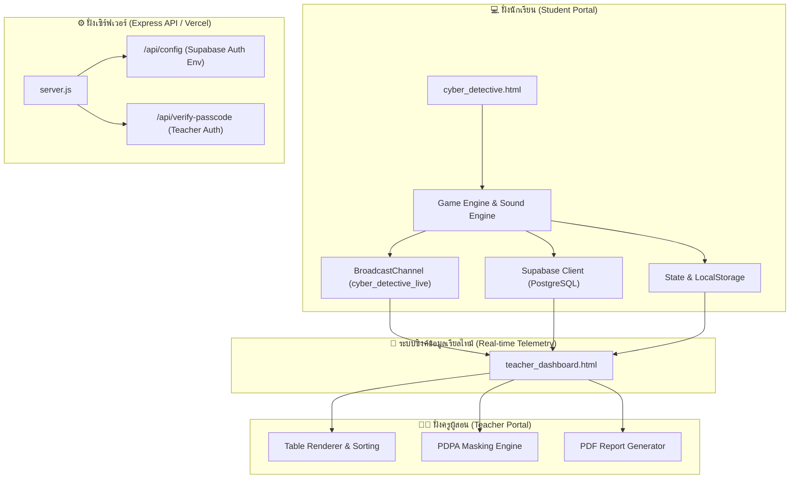

<div align="center">
  
</div>

# 🛡️ ศูนย์รวมสื่อการเรียนรู้ & ระบบสืบคดีกฎหมายคอมพิวเตอร์ (Cyber Law Detective & Teacher Platform)

[](file:///c:/Users/aunkh/OneDrive/Desktop/%E0%B8%81%E0%B8%8E%E0%B8%AB%E0%B8%A1%E0%B8%B2%E0%B8%A2%E0%B8%84%E0%B8%AD%E0%B8%A1%E0%B8%9E%E0%B8%B4%E0%B8%A7%E0%B9%80%E0%B8%95%E0%B8%AD%E0%B8%A3%E0%B9%8C/cyber_detective.html)
[](file:///c:/Users/aunkh/OneDrive/Desktop/%E0%B8%81%E0%B8%8E%E0%B8%AB%E0%B8%A1%E0%B8%B2%E0%B8%A2%E0%B8%84%E0%B8%AD%E0%B8%A1%E0%B8%9E%E0%B8%B4%E0%B8%A7%E0%B9%80%E0%B8%95%E0%B8%AD%E0%B8%A3%E0%B9%8C/cyber_detective.html)
[](file:///c:/Users/aunkh/OneDrive/Desktop/%E0%B8%81%E0%B8%8E%E0%B8%AB%E0%B8%A1%E0%B8%B2%E0%B8%A2%E0%B8%84%E0%B8%AD%E0%B8%A1%E0%B8%9E%E0%B8%B4%E0%B8%A7%E0%B9%80%E0%B8%95%E0%B8%AD%E0%B8%A3%E0%B9%8C/server.js)
[](https://supabase.com)
[](file:///c:/Users/aunkh/OneDrive/Desktop/%E0%B8%81%E0%B8%8E%E0%B8%AB%E0%B8%A1%E0%B8%B2%E0%B8%A2%E0%B8%84%E0%B8%AD%E0%B8%A1%E0%B8%9E%E0%B8%B4%E0%B8%A7%E0%B9%80%E0%B8%95%E0%B8%AD%E0%B8%A3%E0%B9%8C/cyber_detective.html)
[](file:///c:/Users/aunkh/OneDrive/Desktop/%E0%B8%81%E0%B8%8E%E0%B8%AB%E0%B8%A1%E0%B8%B2%E0%B8%A2%E0%B8%84%E0%B8%AD%E0%B8%A1%E0%B8%9E%E0%B8%B4%E0%B8%A7%E0%B9%80%E0%B8%95%E0%B8%AD%E0%B8%A3%E0%B9%8C/package.json)

**แพลตฟอร์มสื่อการเรียนรู้แบบมีปฏิสัมพันธ์ (Interactive Learning Platform)** และเกมจำลองสืบคดีอาชญากรรมทางเทคโนโลยีวิชา **พ.ร.บ. ว่าด้วยการกระทำความผิดเกี่ยวกับคอมพิวเตอร์** และ **พระราชบัญญัติคุ้มครองข้อมูลส่วนบุคคล (PDPA)** สำหรับนักเรียนระดับชั้นมัธยมศึกษาปีที่ 3 พร้อมระบบแดชบอร์ดติดตามคะแนนแบบเรียลไทม์ (Real-time Telemetry Dashboard) สำหรับครูผู้สอน

---

## 📌 สารบัญ (Table of Contents)
- [รายงานการอัปเดตและปรับปรุงระบบล่าสุด (Changelog & Recent Updates)](#-รายงานการอัปเดตและปรับปรุงระบบล่าสุด-changelog--recent-updates)
- [ภาพรวมแพลตฟอร์ม (Overview)](#-ภาพรวมแพลตฟอร์ม-overview)
- [ความเป็นมาของเกม (Game History & Background)](#-ความเป็นมาของเกม-game-history--background)
- [วิธีการเล่นเกม (How to Play)](#-วิธีการเล่นเกม-how-to-play)
- [ตัวอย่างแฟ้มคดีในเกม (Case Examples)](#-ตัวอย่างแฟ้มคดีในเกม-case-examples)
- [ประโยชน์ที่คาดว่าจะได้รับ (Expected Benefits)](#-ประโยชน์ที่คาดว่าจะได้รับ-expected-benefits)
- [สถาปัตยกรรมระบบ (System Architecture)](#-สถาปัตยกรรมระบบ-system-architecture)
- [ฟีเจอร์เด่นและโมดูลสำคัญ (Key Features & Modules)](#-ฟีเจอร์เด่นและโมดูลสำคัญ-key-features--modules)
- [แผนผังเส้นทางและ Clean URLs (Routing & Sitemap)](#-แผนผังเส้นทางและ-clean-urls-routing--sitemap)
- [ระบบคำนวณคะแนนและเกณฑ์ประเมิน (Scoring & Grading Mechanics)](#-ระบบคำนวณคะแนนและเกณฑ์ประเมิน-scoring--grading-mechanics)
- [ระบบความปลอดภัย & PDPA Privacy Protection](#-ระบบความปลอดภัย--pdpa-privacy-protection)
- [เทคโนโลยีที่ใช้พัฒนา (Tech Stack)](#-เทคโนโลยีที่ใช้พัฒนา-tech-stack)
- [โครงสร้างไฟล์โปรเจกต์ (Project Directory Structure)](#-โครงสร้างไฟล์โปรเจกต์-project-directory-structure)
- [ขั้นตอนการติดตั้งและรันในเครื่อง (Local Installation)](#-ขั้นตอนการติดตั้งและรันในเครื่อง-local-installation)
- [การนำขึ้นระบบ Vercel (Deployment Guide)](#-การนำขึ้นระบบ-vercel-deployment-guide)
- [รายงานการสอบทานความถูกต้อง (Automated Audit & Quality Assurance)](#-รายงานการสอบทานความถูกต้อง-automated-audit--quality-assurance)

---

## 🚀 รายงานการอัปเดตและปรับปรุงระบบล่าสุด (Changelog & Recent Updates)

> [!TIP]
> **สรุปรายการอัปเดตและเพิ่มประสิทธิภาพระบบ (ล่าสุด):**

### 1. 🎨 ตัวละครนักสืบ Chibi PNG ปรับปรุงใหม่ & แอนิเมชันลอยตัวโยกย้าย (Cute Chibi Detective Mascots & Continuous Animation)
- **ภาพตัวละคร PNG แบบไม่มีพื้นหลัง (Transparent PNG)**: ยืนประจำตำแหน่งมุมซ้ายล่างของสมุดโน้ตสืบสวน สลับภาพและเปลี่ยนสีเรืองแสงตามขั้นตอนสืบสวนอัตโนมัติ:
  - `assets/mascot_scan.png` (ขั้นตอนสแกนหลักฐาน - ถือแว่นขยายเรืองแสง)
  - `assets/mascot_law.png` (ขั้นตอนเลือกกฎหมาย - ถือสมุดกฎหมายไซเบอร์)
  - `assets/mascot_judge.png` (ขั้นตอนตัดสินโทษ - สวมชุดผู้พิพากษาถือค้อน)
  - `assets/mascot_win.png` (ขั้นตอนปิดคดี - ชูตราดาวชัยชนะ)
- **ขนาดภาพใหญ่เด่นชัด (140px)** พร้อม **CSS Continuous Floating Animation (`mascotCuteBob`)**: ลอยตัว โยกย้าย และยืดขยายสลับอย่างนุ่มนวลตลอด 24 ชั่วโมง โดยไม่หยุดค้าง
- **ลูกศรกล่องคำพูด (Left-pointing Speech Bubble Arrow)**: ชี้เข้าหาตัวละครนักสืบ Chibi พร้อมรายงานสถานะบันทึกสำนวนคดีแบบไม่สปอยล์คำตอบ เพื่อบังคับให้นักเรียนคิดและอ่านคำร้องทุกข์ด้วยตนเอง

### 2. 🧠 ปรับปรุงช้อยส์ตัวเลือกทั้ง 30 คดีสู่ระดับคิดวิเคราะห์เข้มข้น (Rigorous Analytical Distractors Overhaul)
- ยกเลิกลบช้อยส์กฎหมายไม่เกี่ยวข้องและบทลงโทษตลกเดิมออกทั้งหมด
- แทนที่ด้วยมาตราจริงตาม พ.ร.บ.คอมพิวเตอร์ (ม.5, 7, 8, 9, 10, 11, 13, 14, 16) และ PDPA (ม.24, 27, 33, 79) พร้อมกำหนดอัตราโทษตามกฎหมายจริงที่ท้าทายทักษะการคิดวิเคราะห์ของนักเรียน
- ปรับปรุงช้อยส์มินิเกมสแกนหลักฐานขั้นตอนที่ 1 เป็นการเปรียบเทียบระหว่าง:
  1. *ข้อสรุปทางนิติวิทยาศาสตร์ดิจิทัล* (Forensic Log Evidence)
  2. *ข้อโต้แย้งทางเทคนิค* (Technical Defense)
  3. *การตีความข้อบังคับคลาดเคลื่อน* (Policy Misconception)

### 3. 📖 ปรับปรุงความเด่นชัดของโจทย์และคำร้องทุกข์ (High Contrast Case Prominence)
- ขยายขนาดตัวอักษรกล่องคำร้องทุกข์ (`.brief-box`) เพิ่มเป็น `1.05rem` พร้อมพื้นหลัง Dark Slate เข้ม สัดส่วนเน้นข้อความสว่างชัดเจน (`#f8fafc`) และขอบเรืองแสง Cyan Neon
- ปรับปรุง CSS `.side-case-title-box` เพิ่มขนาดฟอนต์ `1.2rem` หนา 800 พร้อม Text Shadow Glow ให้โจทย์เด่นชัดสะดุดตา

---

## 🛡️ ภาพรวมแพลตฟอร์ม (Overview)

แพลตฟอร์มนี้ถูกออกแบบและพัฒนาขึ้นโดยเน้นผู้เรียนเป็นศูนย์กลาง (Learner-Centered Design) เพื่อเปลี่ยนเนื้อหากฎหมายที่ซับซ้อนให้เข้าใจง่าย น่าสนใจ และสร้างการตระหนักรู้จริงผ่านการสวมบทบาทเป็น **"สายสืบไซเบอร์ (Cyber Detective)"**

> [!NOTE]
> **วัตถุประสงค์หลัก:**
> 1. นักเรียนเรียนรู้มาตราสำคัญตาม พ.ร.บ. คอมพิวเตอร์ และ PDPA ผ่านการวิเคราะห์คำร้องทุกข์จริง 30 คดี
> 2. ฝึกทักษะการวิเคราะห์หลักฐานดิจิทัล (Digital Forensics) ผ่านมินิเกมถอดรหัส
> 3. ครูผู้สอนสามารถติดตามความก้าวหน้า ผลคะแนน และเวลาในการทำคดีของนักเรียนทุกคนได้แบบเรียลไทม์ผ่านแดชบอร์ด

---

## 📜 ความเป็นมาของเกม (Game History & Background)

เกมสืบคดีไซเบอร์ถูกพัฒนาขึ้นเพื่อแก้ปัญหาการเรียนรู้วิชากฎหมายเทคโนโลยีสารสนเทศ (พ.ร.บ. คอมพิวเตอร์ พ.ศ. 2550/2560 และ พ.ร.บ. คุ้มครองข้อมูลส่วนบุคคล พ.ศ. 2562) ซึ่งเดิมมีเนื้อหาที่เป็นตัวบทกฎหมายจำนวนมาก ท่องจำยาก และขาดความเชื่อมโยงกับชีวิตประจำวันของนักเรียน

โครงการนี้จึงเปลี่ยนแนวทางการสอนเป็นการเรียนรู้ผ่านเกม (Gamified Learning) โดยให้นักเรียนสวมบทบาทเป็น "สายสืบไซเบอร์" ทำหน้าที่สืบสวนคำร้องทุกข์จริง รวบรวมและถอดรหัสหลักฐานดิจิทัล พิพากษาข้อหา และเรียนรู้บทลงโทษทางกฎหมาย เพื่อสร้างความตระหนักรู้ในการใช้งานเทคโนโลยีอย่างปลอดภัยและรับผิดชอบต่อสังคม

---

## 🎮 วิธีการเล่นเกม (How to Play)

1. **ลงทะเบียนสายสืบ:** เข้าสู่ระบบที่ [cyber_detective.html](cyber_detective.html) กรอกคำนำหน้า ชื่อ-นามสกุล เลขที่ ชั้นเรียน (ม.3/1 - ม.3/10) และตั้งนามแฝงสายสืบ
2. **สุ่มรับแฟ้มคดี:** ระบบใช้ Smart Deck Rotation สุ่ม 6 คดีจากคลัง 30 คดีโดยไม่ซ้ำกันในรอบการเล่น
3. **สแกนหลักฐานดิจิทัล:** ในแต่ละคดีจะมีมินิเกมถอดรหัสหลักฐาน 2 ชิ้น 
   - สแกนถูกต้อง: **+25 คะแนน / ชิ้น**
   - สแกนผิด: **-15 คะแนน / ชิ้น** (หลักฐานโดนล็อก)
4. **ตัดสินข้อหาและบทลงโทษ:** อ่านคำร้องทุกข์และหลักฐานเพื่อเลือกมาตรากฎหมายและบทลงโทษ
   - ตอบถูกต้อง: **+100 คะแนน** (พร้อมโบนัสความไวสูงสุด +30 คะแนน)
   - ตอบผิด: หัก **-30 ถึง -60 คะแนน** (หากตอบผิดติดต่อกัน 3 ครั้ง จะติด Cooldown 5 วินาที)
5. **ศึกษา Flashcard และพิมพ์รายงาน:** เมื่อตัดสินถูกจะแสดงการ์ดสรุปมาตรากฎหมาย และเมื่อทำครบ 6 คดี ระบบจะสรุปเกรดประเมินผล (A+ ถึง D) พร้อมปุ่มพิมพ์รายงานสรุปผล PDF

---

## 📂 ตัวอย่างแฟ้มคดีในเกม (Case Examples)

| รหัสคดี | สถานการณ์คำร้องทุกข์ | ฐานความผิดที่ถูกต้อง | บทลงโทษตามกฎหมาย |
| :--- | :--- | :--- | :--- |
| **CASE-001** | แอบดูรหัสผ่านเฟซบุ๊กผู้อื่น แล้วแอบเข้าสู่ระบบไปอ่านข้อความแชทส่วนตัว | **พ.ร.บ.คอมพิวเตอร์ มาตรา 5 / 7** (เข้าถึงระบบและข้อมูลโดยมิชอบ) | จำคุกไม่เกิน 2 ปี หรือปรับไม่เกิน 40,000 บาท หรือทั้งจำทั้งปรับ |
| **CASE-008** | ร้านค้าออนไลน์นำเบอร์โทรและอีเมลลูกค้าไปขายต่อให้บริษัทประกันโดยไม่ยินยอม | **พ.ร.บ. คุ้มครองข้อมูลส่วนบุคคล (PDPA)** (เปิดเผยข้อมูลส่วนบุคคลโดยไม่ยินยอม) | โทษปรับทางปกครองไม่เกิน 3,000,000 บาท |
| **CASE-015** | แอบดักรับสัญญาณ Wi-Fi เพื่อดักรับข้อมูลแชทและรหัสผ่านของผู้อื่นในร้านกาแฟ | **พ.ร.บ.คอมพิวเตอร์ มาตรา 8** (ดักรับข้อมูลคอมพิวเตอร์ระหว่างการส่ง) | จำคุกไม่เกิน 3 ปี หรือปรับไม่เกิน 60,000 บาท หรือทั้งจำทั้งปรับ |
| **CASE-022** | ตัดต่อภาพเพื่อนให้มีหน้าตาตลกขบขันแล้วโพสต์ลงโซเชียลจนเพื่อนถูกดูหมิ่นอับอาย | **พ.ร.บ.คอมพิวเตอร์ มาตรา 16** (ตัดต่อภาพผู้อื่นนำเข้าสู่ระบบทำให้ผู้อื่นอับอาย) | จำคุกไม่เกิน 3 ปี และปรับไม่เกิน 200,000 บาท |

---

## 🌟 ประโยชน์ที่คาดว่าจะได้รับ (Expected Benefits)

### ประโยชน์ต่อผู้เรียน (นักเรียน)
- **สร้างความตระหนักรู้กฎหมายไซเบอร์:** ตระหนักถึงความสำคัญของ พ.ร.บ.คอมพิวเตอร์ และ PDPA ในการใช้งานอินเทอร์เน็ตประจำวัน
- **พัฒนาทักษะการคิดวิเคราะห์:** ฝึกกระบวนการสืบสวน แยกแยะหลักฐาน และประเมินข้อเท็จจริงอย่างมีเหตุผล
- **ป้องกันการกระทำความผิดโดยไม่ตั้งใจ:** เข้าใจขอบเขตของกฎหมายและผลกระทบของการละเมิดสิทธิผู้อื่น

### ประโยชน์ต่อผู้สอนและสถานศึกษา (ครู & โรงเรียน)
- **ได้สื่อการสอน Interactive Modern:** ลดช่องว่างความน่าเบื่อในวิชากฎหมาย เพิ่มการมีส่วนร่วมในห้องเรียน
- **ระบบติดตามผลเรียลไทม์:** ครูติดตามความก้าวหน้าและคะแนนผ่าน [teacher_dashboard.html](teacher_dashboard.html) ได้ทันทีแบบไม่ต้องตรวจมือ
- **คุ้มครองความเป็นส่วนตัวตาม PDPA:** มีระบบ PDPA Data Masking ซ่อนชื่อจริงนักเรียนขณะเปิดจอแสดงผลสาธารณะ

---

## 🏗️ สถาปัตยกรรมระบบ (System Architecture)

ระบบใช้สถาปัตยกรรมกระจายสัญญาณแบบ **Hybrid Multi-Channel Telemetry (Supabase + BroadcastChannel + LocalStorage Sync)** ช่วยให้การรับส่งข้อมูลระหว่างหน้าเกมของนักเรียนและแดชบอร์ดครูผู้สอนเป็นไปอย่างรวดเร็วและไม่ตกหล่น



---

## ✨ ฟีเจอร์เด่นและโมดูลสำคัญ (Key Features & Modules)

### 1. 🕵️ เกมสืบคดีไซเบอร์ 30 แฟ้มคดี (`cyber_detective.html`)
- **Smart Deck Rotation**: อัลกอริทึมสุ่มคดีทีละ 6 คดี โดยไม่ซ้ำคดีเดิมจนกว่าจะทำครบทั้ง 30 คดี
- **Forensic Clue Mini-game**: มินิเกมถอดรหัสสแกนหลักฐานดิจิทัล ตอบถูกได้รับ **+25 คะแนน**, ตอบผิดถูกล็อกหลักฐานและหัก **-15 คะแนน**
- **Post-Case Knowledge Flashcard**: เมื่อตัดสินคดีถูกต้อง ระบบจะแสดงการ์ดสรุปมาตราและบทลงโทษทางกฎหมายเพื่อสร้างความตระหนักรู้
- **Anti-Spam Guessing Cooldown**: หากตอบผิดติดต่อกัน 3 ครั้ง ระบบจะล็อกปุ่มตัดสินคดีชั่วคราว **5 วินาที** พร้อมตัวนับถอยหลัง เพื่อบังคับให้อ่านและวิเคราะห์เบาะแสใหม่
- **Custom PDF Naming Format**: เมื่อกดพิมพ์/บันทึกไฟล์ส่งครู ระบบจะกำหนดชื่อไฟล์ PDF อัตโนมัติเป็น:
  $$\text{ชื่อไฟล์ PDF} = \text{[คำนำหน้า][ชื่อ] [นามสกุล] เลขที่ [เลขที่] [ห้อง]}$$
  *(เช่น `ด.ช.ภูริพงศ์ แก่นกุล เลขที่ 33 ม.3-8.pdf`)*
- **Reset & Safety Navigation**: เมื่อทำคดีครบ 6 คดีในหน้าสรุปผล ปุ่ม "ปิดหน้าต่าง" และ "เล่นรอบใหม่" จะทำการล้างเซสชันและพานักเรียนกลับสู่หน้าลงทะเบียนแรกสุดเสมอ ป้องกันสถานะเกมค้าง

### 2. 📊 แดชบอร์ดสรุปผลครูผู้สอน (`teacher_dashboard.html`)
- **Real-time Live Monitoring**: อัปเดตข้อมูลนักเรียนที่กำลังทำคดีทันทีโดยไม่ต้องกดรีเฟรช
- **PDPA Privacy Masking**: ปุ่มสลับโหมด "ซ่อน/แสดงชื่อจริง-เลขที่" เพื่อคุ้มครองข้อมูลส่วนบุคคลขณะเปิดจอโปรเจกเตอร์ในห้องเรียน
- **Dynamic Sorting & Filtering**: กรองรายห้อง (ม.3/1 - ม.3/10), ค้นหาชื่อ/นามสกุล/นามแฝง, จัดอันดับตามคะแนนสูงสุด, เวลาที่ใช้ หรือเรียงตามเลขที่
- **Clean PDF Export**: ปุ่มส่งออกรายงานสรุปคะแนนประจำห้องเรียนเป็นไฟล์ PDF สำหรับบันทึกเป็นหลักฐานการสอน

### 3. 📖 คลังข้อสอบ & เฉลยฉบับครู (`cases_reference.html`)
- รวบรวมแฟ้มคดีทั้ง 30 คดีไว้ในรูปแบบหมวดหมู่กฎหมาย
- มีระบบล็อกเฉลยคำตอบ (Answer Key) ด้วยรหัสผ่านครูผู้สอน (`Passcode Locked`)

### 4. 📺 สไลด์เนื้อหาบทเรียนปฏิสัมพันธ์ (`presentation.html`)
- สไลด์นำเสนอเนื้อหา พ.ร.บ. คอมพิวเตอร์ และ PDPA สไตล์ Cyberpunk 8-Bit
- รองรับการควบคุมด้วยแป้นพิมพ์ (Arrow Keys / Spacebar / Touch Swipe)

---

## 🚀 แผนผังเส้นทางและ Clean URLs (Routing & Sitemap)

ระบบรองรับทั้ง Clean URLs บน Web Server และการคลิกเปิดไฟล์โดยตรงบนเครื่อง (Offline File Protocol):

| Clean URL Path | ไฟล์ที่เรียกใช้งาน | คำอธิบายโมดูล & ฟังก์ชันการทำงาน |
| :--- | :--- | :--- |
| **`/`** | [index.html](file:///c:/Users/aunkh/OneDrive/Desktop/%E0%B8%81%E0%B8%8E%E0%B8%AB%E0%B8%A1%E0%B8%B2%E0%B8%A2%E0%B8%84%E0%B8%AD%E0%B8%A1%E0%B8%9E%E0%B8%B4%E0%B8%A7%E0%B9%80%E0%B8%95%E0%B8%AD%E0%B8%A3%E0%B9%8C/index.html) | **Cyber Hub**: หน้าแรกศูนย์รวมการเข้าสู่ระบบต่างๆ พร้อมเมนูเลือกการทำงาน |
| **`/detective`** | [cyber_detective.html](file:///c:/Users/aunkh/OneDrive/Desktop/%E0%B8%81%E0%B8%8E%E0%B8%AB%E0%B8%A1%E0%B8%B2%E0%B8%A2%E0%B8%84%E0%B8%AD%E0%B8%A1%E0%B8%9E%E0%B8%B4%E0%B8%A7%E0%B9%80%E0%B8%95%E0%B8%AD%E0%B8%A3%E0%B9%8C/cyber_detective.html) | **Cyber Detective Game**: เกมสืบคดีสุ่ม 6 คดี ระบบมินิเกม เสียง Ambient สรุปคะแนน และออก PDF |
| **`/teacher`** | [teacher_dashboard.html](file:///c:/Users/aunkh/OneDrive/Desktop/%E0%B8%81%E0%B8%8E%E0%B8%AB%E0%B8%A1%E0%B8%B2%E0%B8%A2%E0%B8%84%E0%B8%AD%E0%B8%A1%E0%B8%9E%E0%B8%B4%E0%B8%A7%E0%B9%80%E0%B8%95%E0%B8%AD%E0%B8%A3%E0%B9%8C/teacher_dashboard.html) | **Teacher Live Dashboard**: แดชบอร์ดเรียลไทม์ครูผู้สอน กรองห้อง จัดอันดับ ซ่อนชื่อ และออกรายงาน |
| **`/presentation`** | [presentation.html](file:///c:/Users/aunkh/OneDrive/Desktop/%E0%B8%81%E0%B8%8E%E0%B8%AB%E0%B8%A1%E0%B8%B2%E0%B8%A2%E0%B8%84%E0%B8%AD%E0%B8%A1%E0%B8%9E%E0%B8%B4%E0%B8%A7%E0%B9%80%E0%B8%95%E0%B8%AD%E0%B8%A3%E0%B9%8C/presentation.html) | **Cyber Law Presentation**: สไลด์สื่อการเรียนรู้มาตรากฎหมาย และตัวอย่างกรณีศึกษา |
| **`/cases`** | [cases_reference.html](file:///c:/Users/aunkh/OneDrive/Desktop/%E0%B8%81%E0%B8%8E%E0%B8%AB%E0%B8%A1%E0%B8%B2%E0%B8%A2%E0%B8%84%E0%B8%AD%E0%B8%A1%E0%B8%9E%E0%B8%B4%E0%B8%A7%E0%B9%80%E0%B8%95%E0%B8%AD%E0%B8%A3%E0%B9%8C/cases_reference.html) | **Cases Reference & Answer Key**: คลังแฟ้มคดีทั้ง 30 คดี และเฉลยฉบับครูปลดล็อกด้วยรหัสผ่าน |

---

## 🎮 ระบบคำนวณคะแนนและเกณฑ์ประเมิน (Scoring & Grading Mechanics)

ในการเล่น 1 รอบ (สุ่ม 6 คดี) มีคะแนนรวมสูงสุด **1,080 คะแนนดิบ** ซึ่งระบบจะแปลงเป็นคะแนนเก็บเต็ม 10 บนแดชบอร์ดครูให้อัตโนมัติ:

### 1. สูตรการคำนวณคะแนนต่อคดี
$$\text{คะแนนรวม/คดี} = \text{คะแนนฐานถูก (100)} + \text{โบนัสความไว (15-30)} + \text{ถอดรหัสหลักฐาน 2 ชิ้น (50)}$$

### 2. ตารางเกณฑ์การได้/เสียคะแนน
| กิจกรรม / เงื่อนไข | คะแนนที่ได้ / เสีย | หมายเหตุ |
| :--- | :---: | :--- |
| **สแกนถอดรหัสหลักฐานสำเร็จ** | <span style="color: #10b981; font-weight: bold;">+25 คะแนน / ชิ้น</span> | มี 2 ชิ้น/คดี (รวมสูงสุด +50) |
| **สแกนถอดรหัสหลักฐานผิด** | <span style="color: #ef4444; font-weight: bold;">-15 คะแนน / ชิ้น</span> | หลักฐานถูกล็อกสแกนซ้ำไม่ได้ |
| **ตัดสินข้อหาและบทลงโทษถูก** | <span style="color: #10b981; font-weight: bold;">+100 คะแนน</span> | คะแนนฐานคำพิพากษา |
| **โบนัสความไว (เสร็จใน $\le 45$ วินาที)** | <span style="color: #10b981; font-weight: bold;">+30 คะแนน</span> | โบนัสความไวระดับสูงสุด |
| **โบนัสความไว (เสร็จใน $\le 90$ วินาที)** | <span style="color: #10b981; font-weight: bold;">+15 คะแนน</span> | โบนัสความไวระดับปานกลาง |
| **ตัดสินข้อหา หรือ บทลงโทษผิด** | <span style="color: #ef4444; font-weight: bold;">-30 ถึง -60 คะแนน</span> | หักข้อละ -30 คะแนน (แก้ตอบใหม่ได้) |

### 3. สูตรแปลงคะแนนเก็บเต็ม 10 และเกณฑ์ประเมินเกรด
$$\text{คะแนนเก็บเต็ม 10} = \min\left(10, \frac{\text{คะแนนดิบที่ได้}}{1080} \times 10\right)$$

| เปอร์เซ็นต์คะแนนดิบ | ระดับเกรดประเมินผล | ความหมาย |
| :--- | :--- | :--- |
| **$\ge 85\%$** | <span style="color: #10b981; font-weight: bold;">ระดับ A+ (ดีเยี่ยม)</span> | เข้าใจกฎหมายคอมพิวเตอร์และ PDPA อย่างลึกซึ้ง |
| **$70\% - 84\%$** | <span style="color: #38bdf8; font-weight: bold;">ระดับ B (ดี)</span> | วิเคราะห์หลักฐานและกฎหมายได้ดี |
| **$50\% - 69\%$** | <span style="color: #f59e0b; font-weight: bold;">ระดับ C (พอใช้)</span> | ผ่านเกณฑ์มาตรฐานการเรียนรู้ |
| **$< 50\%$** | <span style="color: #ef4444; font-weight: bold;">ระดับ D (ควรปรับปรุง)</span> | ควรศึกษาเนื้อหาในสไลด์บทเรียนเพิ่มเติม |

---

## 🔐 ระบบความปลอดภัย & PDPA Privacy Protection

> [!IMPORTANT]
> **มาตรการความปลอดภัยและการคุ้มครองข้อมูลส่วนบุคคล:**
> 1. **Server-side Passcode Verification**: การยืนยันรหัสผ่านครูผู้สอนทำผ่าน `POST /api/verify-passcode` บน Express Server ป้องกันการแอบดูรหัสผ่านจาก Client Source Code
> 2. **Anti-Cheat Randomization**: ช้อยส์และมินิเกมใช้ Fisher-Yates Shuffle สุ่มตำแหน่งใหม่ทุกครั้ง ป้องกันการจำตำแหน่งตอบ
> 3. **PDPA Data Masking**: แดชบอร์ดครูมีโหมดซ่อนชื่อ-นามสกุลจริง `*** ***` สำหรับการแสดงผลสาธารณะในห้องเรียน

---

## 🛠️ เทคโนโลยีที่ใช้พัฒนา (Tech Stack)

```
├── Core Architecture    : HTML5, JavaScript ES6+ (Modular Logic)
├── UI & Styling         : Vanilla CSS3 (Custom Design Tokens, Glassmorphism, Dark Cyberpunk Theme)
├── Audio Synthesizer    : Web Audio API (Procedural Cyber Ambient Drone Engine & SFX)
├── Backend Runtime      : Node.js & Express.js (server.js)
├── Database & Realtime  : Supabase (PostgreSQL Database + Realtime Telemetry Subscription)
├── Cross-Tab Sync       : BroadcastChannel API & Storage Event Listener
└── Hosting & Deployment : Vercel Serverless Architecture (cleanUrls: true)
```

---

## 📂 โครงสร้างไฟล์โปรเจกต์ (Project Directory Structure)

```
.
├── index.html               # [Main Hub] หน้าแรกศูนย์รวมเข้าใช้งานทุกระบบ
├── cyber_detective.html     # [Student Game] เกมสืบคดีสุ่ม 6 คดี สแกนหลักฐาน และออก PDF
├── teacher_dashboard.html   # [Teacher Dashboard] แดชบอร์ดสรุปคะแนนครูผู้สอนเรียลไทม์
├── presentation.html        # [Lesson Slides] สไลด์สื่อการเรียนรู้มาตรากฎหมาย และ PDPA
├── cases_reference.html     # [Cases Reference] คลังแฟ้มคดี 30 คดี และเฉลยฉบับครู
├── cases_data.js            # [Data Bank] ฐานข้อมูลแฟ้มคดีทั้ง 30 คดี ช้อยส์ และ Flashcard
├── server.js                # [Express Server] Node.js Backend Server & Secure APIs
├── vercel.json              # [Vercel Config] การตั้งค่า Routing & Clean URLs บน Vercel
├── favicon.png              # [Brand Icon] ไอคอนโลโก้สายสืบไซเบอร์ขนาด 256x256
├── logo.png                 # [Brand Logo] ตราสัญลักษณ์โปรเจกต์ขนาด 256x256
├── package.json             # [Node Manifest] รายการ Dependencies และ Scripts
├── .env.example             # [Env Template] ตัวอย่างการตั้งค่า Environment Variables
└── README.md                # [Documentation] คู่มือเอกสารอธิบายระบบฉบับสมบูรณ์
```

---

## 💻 ขั้นตอนการติดตั้งและรันในเครื่อง (Local Installation)

### 1. คลองโปรเจกต์ (Clone Repository)
```bash
git clone https://github.com/puripong1st/tech-dm-cyber-detective.git
cd tech-dm-cyber-detective
```

### 2. ติดตั้ง Dependencies
```bash
npm install
```

### 3. ตั้งค่า Environment Variables
คัดลอกไฟล์ `.env.example` เป็น `.env`:
```bash
cp .env.example .env
```
กำหนดค่าตัวแปรในไฟล์ `.env`:
```env
PORT=3000
SUPABASE_URL=https://your-supabase-project.supabase.co
SUPABASE_ANON_KEY=your-supabase-anon-key
TEACHER_PASSCODE=admin123
```

### 4. รันเซิร์ฟเวอร์ทดสอบ (Start Local Server)
```bash
npm start
```
เปิดเบราว์เซอร์ไปที่ `http://localhost:3000`

---

## ☁️ การนำขึ้นระบบ Vercel (Deployment Guide)

โปรเจกต์นี้ได้รับการตั้งค่า `vercel.json` สำหรับ Deploy ขึ้น Vercel ในคลิกเดียว:

1. Push โค้ดขึ้นบน GitHub Repository ของคุณ
2. เข้าไปที่ [Vercel Dashboard](https://vercel.com) แล้วกด **Import Project**
3. กำหนดค่า **Environment Variables** บน Vercel:
   - `SUPABASE_URL`
   - `SUPABASE_ANON_KEY`
   - `TEACHER_PASSCODE`
4. กด **Deploy** — Vercel จะให้บริการในรูปแบบ Clean URLs โดยอัตโนมัติ (เช่น `/detective`, `/teacher`, `/presentation`)

---

## 🧪 รายงานการสอบทานความถูกต้อง (Automated Audit & Quality Assurance)

โปรเจกต์ผ่านการทดสอบด้วยชุดสคริปต์สอบทานอัตโนมัติ (Automated Validation Suite):

> [!TIP]
> **ผลการสอบทานระบบล่าสุด:**
> - **Data Integrity (`cases_data.js`)**: 30 คดีถูกต้อง 100%, 0 ID ซ้ำ, มีคำตอบถูกต้องเพียงข้อเดียวทุกคดี
> - **DOM Element References**: สแกน 85 DOM IDs ในทุกไฟล์ HTML — **0 Missing IDs**
> - **CSS & JS Syntax Audit**: สแกนไวยากรณ์สคริปต์และสไตล์ชีตทั้งหมด — **0 Syntax Errors**

---

© 2026 Cyber Law Detective & Teacher Platform. Developed for Cyber Law Educational Excellence.
