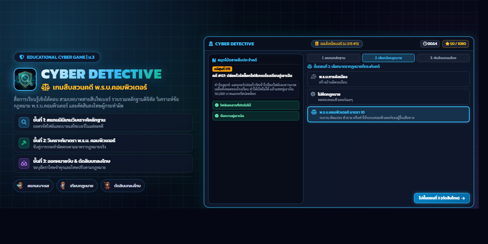

<div align="center">
  
</div>

# 🛡️ Cyber Shield Detective: ปฏิบัติการสายสืบพิทักษ์ไซเบอร์ (ม.3)
### ศูนย์รวมสื่อการเรียนรู้ & ระบบสืบคดีกฎหมายคอมพิวเตอร์และ PDPA ด้วยระบบประเมินผล AI

[](cyber_shield_detective.html)
[](https://aistudio.google.com)
[](cyber_shield_detective.html)
[](https://supabase.com)
[](cyber_shield_detective.html)
[](package.json)

**Cyber Shield Detective** เป็นแพลตฟอร์มเกมการเรียนรู้เชิงโต้ตอบ (Interactive Learning & Forensic Simulation Web Application) เรื่อง **พ.ร.บ. ว่าด้วยการกระทำความผิดเกี่ยวกับคอมพิวเตอร์ (ฉบับแก้ไขเพิ่มเติม)** และ **พระราชบัญญัติคุ้มครองข้อมูลส่วนบุคคล (PDPA)** ออกแบบมาเฉพาะสำหรับนักเรียนระดับชั้นมัธยมศึกษาปีที่ 3 เพื่อเสริมสร้างทักษะการคิดวิเคราะห์ นิติวิทยาศาสตร์ดิจิทัล และความมั่นคงปลอดภัยไซเบอร์ผ่านการ์ตูน 9 ช่อง และการประเมินผลอัตนัยด้วย **Google Gemini Generative AI**

---

## 📌 สารบัญ (Table of Contents)
- [🎮 จุดเด่นของเกม Cyber Shield Detective](#-จุดเด่นของเกม-cyber-shield-detective)
- [🛡️ ระบบความปลอดภัยและป้องกันการโกง (Anti-Cheat & Security Shield)](#️-ระบบความปลอดภัยและป้องกันการโกง-anti-cheat--security-shield)
- [🤖 ระบบวิเคราะห์คำตอบด้วย Google Gemini AI (No-Spoiler AI Evaluator)](#-ระบบวิเคราะห์คำตอบด้วย-google-gemini-ai-no-spoiler-ai-evaluator)
- [📚 แฟ้ม 12 คดีหลักฐานการ์ตูน 9 ช่อง](#-แฟ้ม-12-คดีหลักฐานการ์ตูน-9-ช่อง)
- [📊 ระบบรายงานผลคะแนนกลุ่ม & พิมพ์ PDF เรียงตามเลขที่](#-ระบบรายงานผลคะแนนกลุ่ม--พิมพ์-pdf-เรียงตามเลขที่)
- [⚡ การติดตั้งฐานข้อมูล Supabase Realtime](#-การติดตั้งฐานข้อมูล-supabase-realtime)
- [⚙️ การตั้งค่าสภาพแวดล้อม (.env)](#️-การตั้งค่าสภาพแวดล้อม-env)
- [🚀 ขั้นตอนการติดตั้งและรันในเครื่อง (Local Setup)](#-ขั้นตอนการติดตั้งและรันในเครื่อง-local-setup)
- [🌐 การเปิดเล่นผ่าน GitHub Pages & Vercel](#-การเปิดเล่นผ่าน-github-pages--vercel)
- [🗺️ แผนผังหน้าเว็บในโปรเจกต์ (Sitemap & Hub)](#️-แผนผังหน้าเว็บในโปรเจกต์-sitemap--hub)

---

## 🎮 จุดเด่นของเกม Cyber Shield Detective

```
┌─────────────────────────────────────────────────────────────────────────────┐
│                 CYBER SHIELD DETECTIVE: CORE GAMEPLAY LOOP                  │
│                                                                             │
│  [1. ทะเบียนทีม & สมาชิก] ──► [2. สุ่ม 6 คดีการ์ตูน] ──► [3. วิเคราะห์ 3 มิติ]│
│  - เลือกห้อง ม.3/1 - 3/15    - ภาพหลักฐาน Opaque Hashed   - 👨‍⚖️ นักกฎหมายไซเบอร์│
│  - สมาชิก 1-10 คน (ด.ช./ด.ญ.)- ไทม์ไลน์ 3 ช่วง 9 ช่อง    - 🚑 ผู้บรรเทาเหตุฉุกเฉิน│
│  - บันทึกลง LocalStorage       - ซูมดู Lightbox คมชัด    - 🛡️ วิศวกรความปลอดภัย│
│                                                                             │
│                                      ▼                                      │
│  [6. รายงานผล & PDF] ◄── [5. บันทึกผล & อันดับ] ◄── [4. Gemini AI วิเคราะห์] │
│  - สรุปคะแนน 3 มิติ            - บันทึกลง Supabase Realtime- ให้เหตุผลเชิงแนวคิด │
│  - Export PDF เรียงเลขที่แนวตั้ง- Leaderboard สด            - ตรวจจับพิมพ์มั่ว/สแปม │
└─────────────────────────────────────────────────────────────────────────────┘
```

1. **การวิเคราะห์อัตนัย 3 บทบาทเชิงลึก (3 Forensic Dimensions)**:
   - 👨‍⚖️ **นักกฎหมายไซเบอร์ (Legal Dimension - 10 คะแนน):** วิเคราะห์พฤติการณ์ความผิดตาม พ.ร.บ.คอมพิวเตอร์/PDPA พร้อมประเมินอัตราโทษจำคุกและปรับ
   - 🚑 **ผู้บรรเทาเหตุฉุกเฉิน (Incident Remedy - 10 คะแนน):** กำหนดขั้นตอนการตัดวงจรความเสียหายทันที และระบุผู้รับผิดชอบหรือหน่วยงานที่มีอำนาจระงับเหตุ
   - 🛡️ **วิศวกรความปลอดภัย (Security Engineering - 10 คะแนน):** เสนอแนะมาตรการทางเทคนิคและเทคโนโลยีเพื่อปิดช่องโหว่ความเสี่ยงในระยะยาว
2. **ระบบสุ่มคดีอัตโนมัติ (6 Random Cases)**: จากคลังคดีการ์ตูน 12 มาตรา เพื่อความหลากหลายในแต่ละรอบการเล่น
3. **ระบบป้องกันข้อมูลสูญหาย (F5 Auto-Save)**: กดรีเฟรชหรือสลับหน้าต่าง ระบบจะจำสถานะการเล่น สมาชิก และคำตอบเดิมผ่าน `localStorage` โดยอัตโนมัติ พร้อมปุ่มยืนยันเริ่มเล่นใหม่

---

## 🛡️ ระบบความปลอดภัยและป้องกันการโกง (Anti-Cheat & Security Shield)

ระบบได้รับการออกแบบด้วยหลักการ Zero-Knowledge Anti-Cheat เพื่อป้องกันไม่ให้นักเรียนโกงหรือแอบดูคำตอบ:

1. **การเข้ารหัสชื่อไฟล์ภาพหลักฐาน (Opaque Hashed Filenames)**:
   - ภาพหลักฐานในโฟลเดอร์ `assets/evidence/` ถูกเปลี่ยนชื่อเป็นรหัสแฮชสุ่ม (เช่น `case_ev_8f3a9b21.png`)
   - ป้องกันการแอบดูชื่อไฟล์ภาพ (เช่น `มาตรา 8.png`) ผ่าน Network Tab หรือการ Inspect Element
2. **Anti-DevTools & Anti-Inspect Shield**:
   - ปิดการใช้งานปุ่ม **`F12`**, **`Ctrl+Shift+I`**, **`Ctrl+Shift+J`**, **`Ctrl+Shift+C`**
   - ปิดการใช้งาน **`Ctrl+U`** (View Source) และ **`Ctrl+S`** (Save Webpage)
   - ปิดการคลิกขวา (**Right-Click Context Menu**) พร้อมระบบแจ้งเตือนความปลอดภัย (Security Toast Alert)
   - มีระบบดักจับและล้างหน้าต่าง Console อัตโนมัติเมื่อตรวจพบการเปิดหน้าต่าง DevTools
3. **Zero-Spoiler Policy**:
   - ไม่มีข้อความระบุเลขมาตราในแฟ้มคดี, แท็บไทม์ไลน์ 3 ช่วง, หน้าต่างซูม Lightbox หรือตารางคะแนนกลุ่ม

---

## 🤖 ระบบวิเคราะห์คำตอบด้วย Google Gemini AI (No-Spoiler AI Evaluator)

ระบบใช้ Google Gemini API ร่วมกับ Local Heuristic Engine ในการตรวจคำตอบ:

- **การประเมินเชิงการศึกษา (Pedagogical Explanations)**:
  - หากนักเรียนตอบไม่ตรงประเด็นหรือได้คะแนนน้อย AI จะ**ไม่อธิบายเฉลยตรงๆ หรือบอกเลขมาตรา**
  - AI จะอธิบายให้เข้าใจว่าเหตุการณ์ดังกล่าวส่งผลกระทบต่อสิทธิหรือระบบอย่างไร และคำตอบยังขาดมิติใด เพื่อให้นักเรียนฝึกคิดวิเคราะห์
- **ระบบคัดกรองข้อความมั่วและสแปม (Anti-Gibberish Detection)**:
  - ตรวจจับการกดแป้นพิมพ์มั่ว (เช่น `asdfghjk`, `ฟกหกด่าส`, ตัวอักษรซ้ำๆ)
  - ตรวจจับคำตอบเลี่ยง (เช่น `ไม่รู้`, `ขี้เกียจ`, `55555`) และปรับเป็น 0 คะแนนทันทีพร้อมข้อความชี้แนะ

---

## 📚 แฟ้ม 12 คดีหลักฐานการ์ตูน 9 ช่อง

| คดีที่ | ชื่อคดี (พฤติการณ์จำลอง) | ไฟล์ภาพหลักฐาน (Hashed) | สาระสำคัญทางกฎหมาย |
| :---: | :--- | :--- | :--- |
| **01** | แอบส่องระบบไอดีเกมของเพื่อน | `assets/evidence/case_ev_8f3a9b21.png` | การเข้าถึงระบบคอมพิวเตอร์โดยมิชอบ |
| **02** | แจกรหัสผ่านระบบในกลุ่ม Discord | `assets/evidence/case_ev_4e7c1d89.png` | การเปิดเผยมาตรการป้องกันการเข้าถึง |
| **03** | แอบคุ้ยไฟล์ไดอารี่แชทลับส่วนตัว | `assets/evidence/case_ev_9a2b5f34.png` | การเข้าถึงข้อมูลคอมพิวเตอร์โดยมิชอบ |
| **04** | ดักจับข้อมูลธุรกรรมเติมเกมกลางทาง | `assets/evidence/case_ev_1c8e7b54.png` | การดักรับข้อมูลระหว่างการส่ง |
| **05** | มือบอนแอบลบไฟล์โครงงานวิทย์เพื่อน | `assets/evidence/case_ev_6a92f03d.png` | การทำลาย แก้ไข หรือเปลี่ยนแปลงข้อมูล |
| **06** | ยิง DDoS พังเซิร์ฟเวอร์เว็บสอบโรงเรียน | `assets/evidence/case_ev_3f81e6ac.png` | การรบกวน ขัดขวางการทำงานของระบบ |
| **07** | ส่งอีเมลสแปมขายของปลอมตัวตน | `assets/evidence/case_ev_e920d57b.png` | การส่งสแปมโดยปกปิดแหล่งที่มา |
| **08** | บอทสแปมรัวๆ ปิดปุ่มยกเลิกรับข่าวสาร | `assets/evidence/case_ev_7c3a812f.png` | การส่งสแปมรบกวนโดยไม่ให้กดยกเลิก |
| **09** | สร้างเว็บฟิชชิ่งหลอกสกินเกมฟรี | `assets/evidence/case_ev_5b04c9e8.png` | การนำเข้าข้อมูลเท็จหลอกลวงประชาชน |
| **10** | โพสต์ข่าวลวงภัยพิบัติจนคนแตกตื่นวิ่งวุ่น | `assets/evidence/case_ev_a1f9e832.png` | การนำเข้าข้อมูลเท็จสร้างความตื่นตระหนก |
| **11** | โพสต์ภาพ/คลิปโป๊ลงคอมพิวเตอร์สาธารณะ | `assets/evidence/case_ev_2e6d9a41.png` | การนำเข้าข้อมูลลามกสู่ระบบสาธารณะ |
| **12** | ตัดต่อหน้าเพื่อนใส่เอเลี่ยนประจานในโซเชียล | `assets/evidence/case_ev_4d9f1e8a.png` | การนำภาพตัดต่อทำให้ผู้อื่นเสียชื่อเสียง |

---

## 📊 ระบบรายงานผลคะแนนกลุ่ม & พิมพ์ PDF เรียงตามเลขที่

- ปุ่ม **"คะแนนกลุ่ม & PDF"** สำหรับดูสรุปคะแนน 6 คดี พร้อมตารางคะแนนรวม
- **การพิมพ์ PDF (`window.print()`)**: จัดหน้ากระดาษแนวตั้งสำหรับพิมพ์ใบงาน โดยแสดงข้อมูล:
  - `ชื่อกลุ่ม` | `เพศ (ด.ช./ด.ญ.)` | `ชื่อ - นามสกุล` | `ห้อง (ม.3/1 - 3/15)` | `เลขที่` | `คะแนนสะสม`
  - ตารางรายชื่อสมาชิกจะถูกเรียงลำดับตาม **เลขที่ (1-50)** จากน้อยไปมากโดยอัตโนมัติ

---

## ⚡ การติดตั้งฐานข้อมูล Supabase Realtime

นำคำสั่ง SQL ด้านล่างนี้ไปรันใน **Supabase SQL Editor** เพื่อสร้างตารางและเปิดใช้งาน Realtime:

```sql
-- 1. สร้างตารางเก็บผลคะแนนสืบคดี
CREATE TABLE IF NOT EXISTS public.game_scores (
    id BIGINT GENERATED ALWAYS AS IDENTITY PRIMARY KEY,
    created_at TIMESTAMPTZ DEFAULT NOW(),
    player_id TEXT,
    team_name TEXT NOT NULL DEFAULT 'นักสืบเยาวชน',
    members_info TEXT,
    case_id INTEGER,
    case_title TEXT,
    legal_score NUMERIC DEFAULT 0,
    remedy_score NUMERIC DEFAULT 0,
    security_score NUMERIC DEFAULT 0,
    total_score NUMERIC DEFAULT 0,
    student_answers JSONB,
    ai_feedback JSONB
);

-- 2. เปิดใช้งาน Row Level Security (RLS)
ALTER TABLE public.game_scores ENABLE ROW LEVEL SECURITY;

-- 3. กำหนดสิทธิ์ Anonymous Read & Insert
CREATE POLICY "Allow anonymous select" ON public.game_scores FOR SELECT USING (true);
CREATE POLICY "Allow anonymous insert" ON public.game_scores FOR INSERT WITH CHECK (true);

-- 4. เปิดใช้งาน Realtime
ALTER PUBLICATION supabase_realtime ADD TABLE public.game_scores;
```

---

## ⚙️ การตั้งค่าสภาพแวดล้อม (.env)

สร้างไฟล์ `.env` ที่โฟลเดอร์หลักของโปรเจกต์:

```env
PORT=3000
NODE_ENV=development

# Google Gemini API Key สำหรับประเมินผลอัตนัย
GEMINI_API_KEY=your_gemini_api_key_here

# Supabase Realtime Database
SUPABASE_URL=https://your-project.supabase.co
SUPABASE_ANON_KEY=your_supabase_anon_key_here

# รหัสผ่านเฉลยคดีสำหรับครูผู้สอน
TEACHER_PASSCODE=admin123
```

---

## 🚀 ขั้นตอนการติดตั้งและรันในเครื่อง (Local Setup)

```bash
# 1. ติดตั้ง Dependencies
npm install

# 2. เริ่มต้นรันเซิร์ฟเวอร์
npm start
# หรือรันแบบ Dev Watcher
npm run dev

# 3. เปิดเว็บเบราว์เซอร์
# เข้าเล่นเกมหลัก: http://localhost:3000/shield_detective
# หน้าศูนย์รวมสื่อ: http://localhost:3000
```

---

## 🌐 การเปิดเล่นผ่าน GitHub Pages & Vercel

1. **GitHub Pages (Static Mode)**:
   - เข้าเล่นเกมได้โดยตรงผ่าน `https://<username>.github.io/<repo-name>/cyber_shield_detective.html`
   - ระบบจะตรวจคำตอบผ่าน Heuristic Fallback อัตโนมัติ หรือใช้ Client-side Gemini เมื่อกรอก API Key ในแดชบอร์ด
   - รูปภาพทั้งหมดโหลดผ่าน `assets/evidence/*.png` อย่างสมบูรณ์ 100%
2. **Vercel / Node.js Server (Full AI Mode)**:
   - เชื่อมต่อ GitHub Repo กับ Vercel
   - กำหนด Environment Variables (`GEMINI_API_KEY`, `SUPABASE_URL`, `SUPABASE_ANON_KEY`) ใน Vercel Dashboard
   - ระบบจะประเมินผลคำตอบผ่าน Backend Serverless Function โดยอัตโนมัติ

---

## 🗺️ แผนผังหน้าเว็บในโปรเจกต์ (Sitemap & Hub)

| URL Path | ไฟล์หน้าเว็บ | คำอธิบาย |
| :--- | :--- | :--- |
| `/` | `index.html` | ศูนย์รวมสื่อและหน้าหลักเลือกเกม |
| `/shield_detective`, `/game` | `cyber_shield_detective.html` | **เกมหลัก:** สืบคดีอัตนัย AI + Anti-Cheat (ม.3) |
| `/detective_v4` | `cyber_detective_v4.html` | เวอร์ชันสืบคดีอัตนัย AI |
| `/detective` | `cyber_detective.html` | เกมสืบคดีเวอร์ชันช้อยส์เลือกตอบ (v3) |
| `/teacher` | `teacher_dashboard.html` | แดชบอร์ดสรุปคะแนนเรียลไทม์สำหรับครู |
| `/presentation` | `presentation.html` | สไลด์สรุปเนื้อหา พ.ร.บ.คอมพิวเตอร์ & PDPA |
| `/cases` | `cases_reference.html` | คลังข้อมูลอ้างอิง 12 คดี |

---
<div align="center">
  <sub>พัฒนาขึ้นเพื่อสนับสนุนการเรียนการสอนกลุ่มสาระการเรียนรู้วิทยาศาสตร์และเทคโนโลยี (วิทยาการคำนวณ) ระดับชั้น ม.3</sub>
</div>
