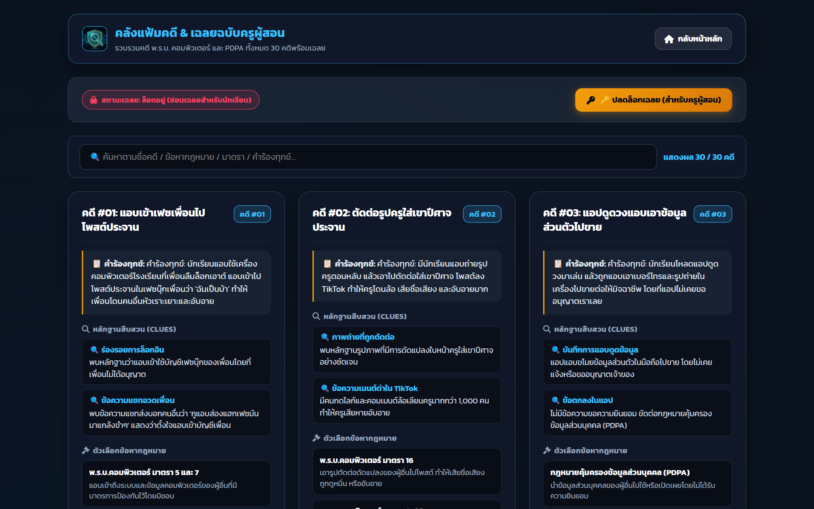
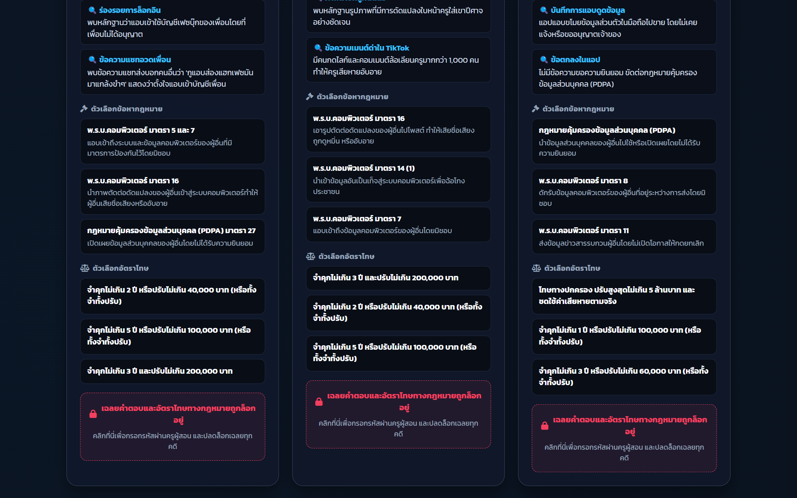

# 📖 คู่มือการใช้งานและโครงสร้างระบบ: คลังคดี 12 คดี & เฉลยครู (`cases_reference.html`)

**คลังแฟ้มคดี & เฉลยฉบับครูผู้สอน (Cases & Answer Keys Bank - `cases_reference.html`)** คือ ศูนย์รวมแฟ้มคดีการ์ตูน 12 คดีหลัก (และคลังสถานการณ์ 30 คดีเสริม) ตาม พ.ร.บ.คอมพิวเตอร์ 2560 และ PDPA 2562 มีระบบสืบค้นคดีด้วยคำค้นหา และระบบรักษาความปลอดภัย **Passcode Unlock** เพื่อซ่อน/เปิดเฉลยแนวทางการตอบ 3 บทบาทสำหรับครูผู้สอน

---

## 🌟 1. ภาพรวมและวัตถุประสงค์ (Overview & Learning Objectives)

### 🎯 วัตถุประสงค์หลัก
1. **คลังข้อมูลอ้างอิงและเฉลยกลาง (Centralized Case & Solution Repository)**: เป็นฐานข้อมูลอ้างอิงสำหรับครูในการเตรียมสอน และให้นักเรียนทบทวนบทเรียนหลังทำกิจกรรม
2. **ระบบควบคุมการเข้าถึงเฉลย (Secure Answer Lock)**: โดยค่าเริ่มต้น ระบบจะแสดงเฉพาะเรื่องย่อ ข้อเท็จจริง และการ์ตูนช่อง แต่จะซ่อนข้อเฉลยและอัตราโทษไว้ จนกว่าครูจะกรอก Passcode ปลดล็อก
3. **ระบบสืบค้นอัจฉริยะ (Realtime Case Filter)**: ค้นหาคดีตามเลขมาตรา, คีย์เวิร์ดพฤติกรรม (เช่น สแปม, แฮก, ตัดต่อ, ดูแชท), หรือชื่อตัวละคร

---

## 👨‍🏫 2. สิ่งที่ครู/ผู้สอนควรชี้แนะแก่นักเรียน (Pedagogical Guidelines)

### 💡 แนวทางการใช้คลังคดีในการสอน
- **ก่อนเริ่มสืบคดี**: ให้นักเรียนเปิดดูคลังคดีเพื่อศึกษารูปแบบพฤติการณ์โดยที่เฉลยยังถูกล็อกอยู่
- **ช่วงเฉลยและอภิปราย (Debriefing)**: ครูปลดล็อกเฉลยบนจอใหญ่ เพื่อให้นักเรียนเปรียบเทียบคำตอบของตนเองกับแนวคำตอบมาตรฐาน (Model Answers)
- **การวิเคราะห์ 3 บทบาทในแต่ละคดี**:
  - *บทบาทกฎหมาย*: ชี้ให้เห็นว่าทำไมคดีนี้ถึงผิดมาตรานี้ และทำไมถึงไม่ผิดมาตราอื่น
  - *บทบาทแก้ไข*: ชี้แจงลำดับความสำคัญในการระงับเหตุ
  - *บทบาทป้องกัน*: อภิปรายแนวทางป้องกันที่ยั่งยืน

---

## 📸 3. ขั้นตอนการใช้งานทีละ Step พร้อมภาพสกรีนช็อตจริง (Step-by-Step Walkthrough)

### 🔹 Step 1: หน้าแสดงรายการคดีและแถบสถานะล็อก (Cases Gallery & Lock Banner)
แสดงการ์ดคดีทั้งหมด พร้อมช่องค้นหา และแถบสีแจ้งสถานะ `🔒 ซ่อนเฉลยสำหรับนักเรียน`


*ภาพที่ 1: หน้าต่างคลังแฟ้มคดี พร้อมช่องค้นหาและปุ่มปลดล็อกสำหรับครู*

---

### 🔹 Step 2: ปลดล็อกและเปิดดูรายละเอียดเชิงลึก (Unlocked Details & 3-Role Answers)
เมื่อครูกรอก Passcode สำเร็จ การ์ดทุกใบจะเปิดเผยแนวคำตอบ 3 บทบาท, องค์ประกอบกฎหมาย, และอัตราโทษ


*ภาพที่ 2: รายละเอียดคดีเมื่อปลดล็อกเฉลย แสดงแนวทางการตอบ 3 บทบาทอย่างครบถ้วน*

---

## 📊 4. เกณฑ์การประเมินและการเปรียบเทียบคำตอบ (Model Answer Evaluation Rubric)

| บทบาท | องค์ประกอบในเฉลยมาตรฐาน (Model Answer Key) | แนวทางการให้คะแนนนักเรียน |
|---|---|---|
| **👨‍⚖️ 1. กฎหมาย (Legal)** | - ระบุมาตราถูกต้อง (เช่น มาตรา 5 + มาตรา 7)<br>- อธิบายพฤติกรรม: แอบใช้รหัสผ่านเพื่อนล็อกอินและเปิดอ่านแชท<br>- อัตราโทษ: จำคุกไม่เกิน 2 ปี หรือปรับไม่เกิน 40,000 บาท | ตรงประเด็นทั้ง 3 จุดได้ 10 คะแนนเต็ม, ขาดอัตราโทษได้ 7-8 คะแนน |
| **🚑 2. แก้ไข (Remedy)** | - บังคับ Logout ทุกเซสชันทันที<br>- เปลี่ยนรหัสผ่านและเปิด 2FA<br>- แจ้งเตือนเพื่อนในกลุ่มและแคปหน้าจอ Log บันทึกหลักฐาน | ระบุขั้นตอนหยุดยั้งได้ทันที 2 ขั้นตอนขึ้นไปได้ 10 คะแนน |
| **🛡️ 3. ป้องกัน (Security)** | - ไม่ตั้งรหัสผ่านที่เดาง่าย (เช่น วันเกิด/เบอร์โทร)<br>- ไม่บันทึกรหัสผ่านบนเครื่องสาธารณะ<br>- ล็อกหน้าจอทุกครั้งเมื่อลุกจากโต๊ะ | ระบุมาตรการป้องกันเชิงพฤติกรรมและระบบได้ชัดเจนได้ 10 คะแนน |

---

## 💻 5. ผ่าสถาปัตยกรรมโค้ดและการทำงานเชิงลึก (Detailed Code Breakdown)

### 📂 การดึงข้อมูลจาก `cases_data.js` และระบบกรองข้อมูล
```javascript
// ฟังก์ชันเรนเดอร์การ์ดคดีและการกรองคำค้นหา
function renderCases(searchQuery = '') {
    const container = document.getElementById('cases-container');
    const query = searchQuery.toLowerCase().trim();
    
    const filtered = ALL_CASES.filter(c => {
        return c.title.toLowerCase().includes(query) ||
               c.lawSection.toLowerCase().includes(query) ||
               c.description.toLowerCase().includes(query);
    });

    container.innerHTML = filtered.map(c => `
        <div class="case-card">
            <div class="case-header">
                <span class="case-badge">คดีที่ #${c.id}</span>
                <span class="law-tag">${c.lawSection}</span>
            </div>
            <h3>${c.title}</h3>
            <p>${c.synopsis}</p>
            ${isTeacherUnlocked ? renderTeacherAnswerKey(c) : '<div class="locked-placeholder">🔒 ปลดล็อกเพื่อดูเฉลย</div>'}
        </div>
    `).join('');
}
```

---

## ⚠️ 6. กรณีพิเศษ การตรวจจับข้อผิดพลาด และวิธีแก้ไข (Edge Cases & Troubleshooting)

| ปัญหา | สาเหตุ | การแก้ไข |
|---|---|---|
| **ลืม Passcode ครูผู้สอน** | ครูลืมรหัสผ่านปลดล็อก | รหัสผ่านตั้งต้นกำหนดไว้ใน `cases_data.js` ครูสามารถตรวจสอบหรือเปลี่ยนได้ที่บรรทัดบนสุดของไฟล์ |
| **ค้นหาแล้วไม่พบคดี** | พิมพ์คำค้นหาตกหล่นหรือใช้คำแสลง | ระบบค้นหาด้วย Substring Match แนะนำให้พิมพ์เฉพาะเลขมาตรา เช่น `มาตรา 5` หรือ `14` |
