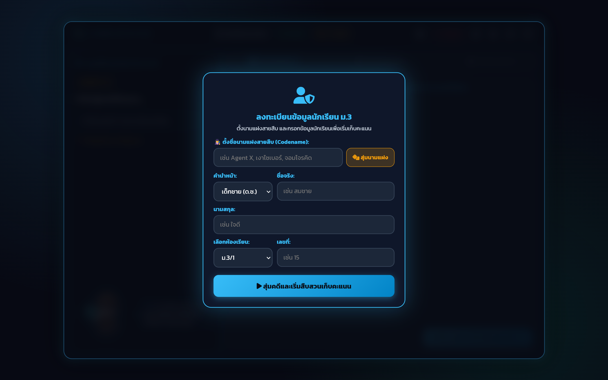
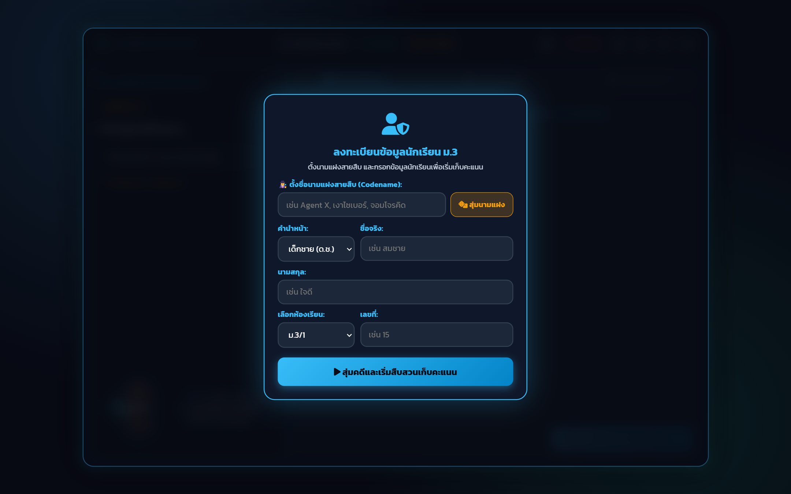

# 📖 คู่มือการใช้งานและโครงสร้างระบบ: Cyber Detective Quiz 30 คดี (`cyber_detective.html`)

**Cyber Detective: สายสืบไซเบอร์ (ทดสอบ 30 คดี - `cyber_detective.html`)** คือ เกมทดสอบความรู้กฎหมายคอมพิวเตอร์และ PDPA ในรูปแบบ **แบบทดสอบปรนัยเชิงสถานการณ์จำลอง (Situational Multiple Choice Quiz)** จำนวน 30 คดี พร้อมระบบสมุดโน้ตสายสืบ (Evidence Notebook), มาสคอต Chibi Detective ตอบสนองต่อการเล่น, ระบบคิดคะแนนแบบ Realtime, และเฉลยอธิบายข้อกฎหมายรายข้อ

---

## 🌟 1. ภาพรวมและวัตถุประสงค์ (Overview & Learning Objectives)

### 🎯 วัตถุประสงค์การเรียนรู้
1. **การประเมินผลสัมฤทธิ์ทางการเรียนรู้ (Summative Legal Quiz)**: วัดความรู้ความเข้าใจ พ.ร.บ.คอมพิวเตอร์ 2560 ครอบคลุม 12 มาตรา ผ่าน 30 สถานการณ์จำลอง
2. **การเรียนรู้จากข้อผิดพลาด (Immediate Formative Feedback)**: เมื่อเลือกตอบแล้ว ระบบจะแสดงเฉลยทันทีพร้อมระบุเหตุผลทางกฎหมายและอัตราโทษ ช่วยให้นักเรียนเข้าใจจุดบกพร่องได้ทันที
3. **สมุดโน้ตวิเคราะห์หลักฐาน (Side Notebook Panel)**: สรุปข้อเท็จจริง คำร้องทุกข์ และคำใบ้ทางเทคนิคควบคู่ไปกับตัวเลือกข้อสอบ

---

## 👨‍🏫 2. สิ่งที่ครู/ผู้สอนควรชี้แนะแก่นักเรียน (Pedagogical Guidelines)

### 💡 แนวทางการใช้เป็นแบบทดสอบก่อน/หลังเรียน
- **Pre-test / Post-test**: สามารถใช้เป็นข้อสอบ Pre-test ก่อนเริ่มหน่วยการเรียนรู้ และใช้เป็น Post-test หลังเรียนจบ 12 มาตรา
- **การอ่านคำร้องทุกข์ในสมุดโน้ต**: แนะนำให้นักเรียนสังเกตคำสำคัญ (Keywords) ในสมุดโน้ตด้านซ้าย เช่น คำว่า "แอบดู", "ส่งสแปม", "แฮกเกอร์", "DDoS", "ตัดต่อภาพ" เพื่อเชื่อมโยงไปยังมาตราที่ถูกต้อง

---

## 📸 3. ขั้นตอนการใช้งานทีละ Step พร้อมภาพสกรีนช็อตจริง (Step-by-Step Walkthrough)

### 🔹 Step 1: หน้าต้อนรับและลงทะเบียนสายสืบ (Welcome & Registration View)
ผู้เรียนกรอกชื่อ นามแฝง ห้อง และเลขที่ เพื่อเริ่มต้นทำแบบทดสอบ 30 คดี


*ภาพที่ 1: หน้าต่างต้อนรับและเริ่มทำแบบทดสอบปรนัย 30 คดี*

---

### 🔹 Step 2: การ์ดข้อสอบและสมุดโน้ตหลักฐาน (Question Card & Side Notebook)
แสดงสถานการณ์คดี ตัวเลือกคำตอบ 4 ตัวเลือก และสมุดโน้ตคำใบ้ด้านซ้าย


*ภาพที่ 2: หน้าจอการทำข้อสอบ แสดงตัวเลือก 4 ช้อยส์ และสมุดโน้ตหลักฐานประจำคดี*

---

## 📊 4. เกณฑ์การประเมินรูบริก (Rubric Matrix for 30-Question Quiz)

| ระดับผลการประเมิน | จำนวนข้อที่ตอบถูก (จาก 30 ข้อ) | คิดเป็นร้อยละ | ระดับคุณภาพ |
|:---:|:---:|:---:|---|
| 🥇 **Cyber Chief Detective (สารวัตรไซเบอร์)** | **27 - 30 ข้อ** | **90% - 100%** | ดีเยี่ยม (เกรด 4) |
| 🥈 **Senior Cyber Investigator (นักสืบชำนาญการ)** | **24 - 26 ข้อ** | **80% - 89%** | ดีมาก (เกรด 3.5) |
| 🥉 **Cyber Detective (สายสืบไซเบอร์)** | **21 - 23 ข้อ** | **70% - 79%** | ดี (เกรด 3) |
| 🎖️ **Junior Detective (นักสืบฝึกหัด)** | **15 - 20 ข้อ** | **50% - 69%** | ผ่านเกณฑ์ (เกรด 2 - 2.5) |
| ⚠️ **Trainee (ต้องฝึกฝนเพิ่มเติม)** | **ต่ำกว่า 15 ข้อ** | **น้อยกว่า 50%** | ไม่ผ่านเกณฑ์ (เกรด 1) |

---

## 💻 5. ผ่าสถาปัตยกรรมโค้ดและการทำงานเชิงลึก (Detailed Code Breakdown)

### 🎮 การทำงานของ Quiz Engine ใน `cyber_detective.html`
```javascript
// ฟังก์ชันตรวจคำตอบและแสดงเฉลยทันที
function selectOption(choiceIndex) {
    const currentQ = quizData[currentQuestionIndex];
    const isCorrect = choiceIndex === currentQ.correctAnswer;

    if (isCorrect) {
        currentScore += 36; // 36 คะแนน x 30 ข้อ = 1,080 คะแนนเต็ม
        playCorrectSound();
        showMascotState('win');
    } else {
        playWrongSound();
        showMascotState('fail');
    }

    // แสดง Feedback กล่องเฉลย
    renderExplanationModal(currentQ, isCorrect);
}
```

---

## ⚠️ 6. กรณีพิเศษ การตรวจจับข้อผิดพลาด และวิธีแก้ไข (Edge Cases & Troubleshooting)

| ปัญหา | สาเหตุ | การแก้ไข |
|---|---|---|
| **สมุดโน้ตด้านซ้ายบังตัวเลือกบนมือถือ** | หน้าจอโทรศัพท์มีความกว้างน้อย | ระบบมีปุ่ม `Toggle Notebook` ให้นักเรียนกดซ่อน/เปิดสมุดโน้ตได้บนมือถือ |
| **กดเริ่มใหม่แล้วคะแนนไม่รีเซ็ต** | ค่าคะแนนถูกแคชในหน่วยความจำ | กดปุ่ม `🔄 เริ่มใหม่` ที่มุมขวาบน ระบบจะรีเซ็ต State และสุ่มลำดับข้อใหม่ทั้งหมด |
