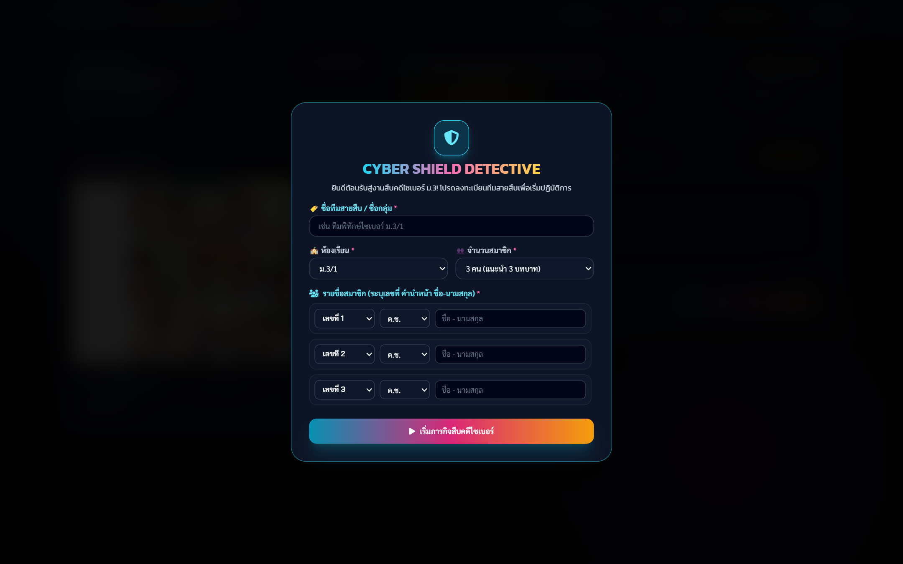
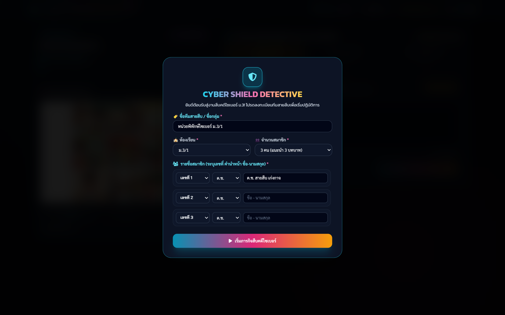

# 📖 คู่มือการใช้งานและโครงสร้างระบบ: Cyber Shield Detective (เวอร์ชันหลัก 6 คดี - `cyber_shield_detective.html`)

**Cyber Shield Detective (เวอร์ชันหลัก 6 คดี)** คือ เกมจำลองสถานการณ์สืบคดีกฎหมายคอมพิวเตอร์ 2560 และ PDPA 2562 ในรูปแบบ **การ์ตูนช่อง (9-Panel Comic Strip) ควบคู่กับระบบตอบคำถามอัตนัย 3 บทบาท** ประเมินผลสดทันทีด้วย **Google Gemini AI Scoring Engine (เต็ม 180 คะแนน)** พร้อมระบบบันทึกและถ่ายทอดสดคะแนนผ่าน Supabase Realtime สู่แดชบอร์ดครู

---

## 🌟 1. ภาพรวมและวัตถุประสงค์ (Overview & Learning Objectives)

### 🎯 วัตถุประสงค์การเรียนรู้
1. **การคิดวิเคราะห์เชิงกฎหมาย (Legal Critical Thinking)**: ฝึกวิเคราะห์พฤติการณ์ในคดีและระบุมาตราความผิดตาม พ.ร.บ.คอมพิวเตอร์ 2560 (มาตรา 5, 6, 7, 8, 9, 10, 11, 12, 14(1), 14(2), 14(4), 16) หรือ PDPA ได้อย่างถูกต้อง
2. **การแก้ไขปัญหาเฉพาะหน้า (Incident Response & Remediation)**: วางแผนระงับเหตุฉุกเฉินทางไซเบอร์ เช่น การเปลี่ยนรหัสผ่าน, การแจ้งอายัดบัญชี, การเก็บหลักฐานดิจิทัล (Log/Timestamp)
3. **การป้องกันและสร้างภูมิคุ้มกันทางเทคนิค (Preventative Cybersecurity Engineering)**: กำหนดมาตรการความปลอดภัยระยะยาว เช่น การตั้งค่า Two-Factor Authentication (2FA), การอัปเดตระบบ, การอบรมความปลอดภัยข้อมูล

### 👥 โครงสร้างคะแนนและเวลาที่เหมาะสม
- **จำนวนคดี**: 6 คดี (สุ่มหรือกำหนดตามลำดับ)
- **คะแนนเต็มรวม**: 180 คะแนน (คดีละ 30 คะแนน = กฎหมาย 10 + บรรเทาภัย 10 + ป้องกัน 10)
- **เวลาที่แนะนำ**: 80 - 100 นาที (หรือ 2 คาบเรียนต่อเนื่อง)

---

## 👨‍🏫 2. สิ่งที่ครู/ผู้สอนควรชี้แนะแก่นักเรียน (Pedagogical Guidelines)

### 💡 คีย์เวิร์ดและสิ่งที่ต้องแนะนำก่อนเริ่มเกม
1. **การทำงานเป็นทีมหรือเดี่ยว**: สามารถตั้งชื่อทีมและระบุสมาชิกได้สูงสุด 3 คน
2. **การตอบคำถาม 3 บทบาท**:
   - **บทบาทที่ 1 (นักวิเคราะห์กฎหมาย)**: ต้องระบุ *ชื่อมาตรา + พฤติกรรมที่ผิด + อัตราโทษ (จำคุก/ปรับ)* ให้ชัดเจน
   - **บทบาทที่ 2 (ผู้ระงับเหตุเฉพาะหน้า)**: ต้องระบุ *ขั้นตอนการแก้ปัญหาทันทีเพื่อหยุดความเสียหาย*
   - **บทบาทที่ 3 (วิศวกรความปลอดภัย)**: ต้องระบุ *วิธีป้องกันไม่ให้เกิดเหตุซ้ำในอนาคต*
3. **ระบบล็อกคำตอบ (Anti-Spam / Single Submission)**: เมื่อกดส่งตรวจ AI ในแต่ละบทบาทแล้ว ระบบจะประเมินคะแนนและล็อกบทบาทนั้นทันที ไม่สามารถแก้ไขหรือก๊อปปี้คำตอบเพื่อนได้

### ⚠️ จุดที่นักเรียนมักทำคะแนนตก (Common Pitfalls)
- **ตอบสั้นเกินไป**: พิมพ์ไม่ถึงเกณฑ์ขั้นต่ำ (20 ตัวอักษร) หรือตอบเพียงแค่ "ผิดมาตรา 5" โดยไม่อธิบายเหตุผลและอัตราโทษ (AI จะหักคะแนนส่วนเหตุผล)
- **สับสนระหว่างโทษปรับกับโทษจำคุก**: จำสลับระหว่าง มาตรา 5 (ปรับ 10,000) กับ มาตรา 7 (ปรับ 40,000)
- **ข้ามขั้นตอนการบรรเทาภัย**: แนะนำให้ไปแจ้งความอย่างเดียวโดยลืมขั้นตอนทางเทคนิค (เช่น การ Logout all devices หรือเปลี่ยน Password)

---

## 📸 3. ขั้นตอนการใช้งานทีละ Step พร้อมภาพสกรีนช็อตจริง (Step-by-Step Walkthrough)

### 🔹 Step 1: ลงทะเบียนทีมและสมาชิก (Team Registration Modal)
เมื่อเปิดหน้าเว็บ ผู้เรียนต้องกรอกชื่อทีม, เลือกระดับชั้น/ห้อง, และระบุชื่อสมาชิกในทีม (1-3 คน) จากนั้นกดปุ่ม **"🚀 ยืนยันข้อมูลและเริ่มปฏิบัติการสืบคดี"**


*ภาพที่ 1: หน้าต่างลงทะเบียนชื่อทีมและสมาชิกก่อนเริ่มเกมสืบคดี*

---

### 🔹 Step 2: อ่านแฟ้มคดีและการ์ตูนช่อง (Case Comic & Evidence Viewer)
เมื่อเข้าสู่คดี ผู้เรียนจะเห็นการ์ตูน 9 ช่องจำลองเหตุการณ์ พร้อมกล่องข้อเท็จจริง (Case Synopsis) และแถบ Stepper แสดงสถานะ 3 บทบาท


*ภาพที่ 2: หน้าต่างสืบคดี การ์ตูนช่อง และแถบสถานะการตรวจคะแนน 3 บทบาท*

---

### 🔹 Step 3: วิเคราะห์และส่งตรวจอัตนัยทีละบทบาท (Role Analysis & AI Feedback)
ผู้เรียนคลิกเลือกบทบาท (1. กฎหมาย -> 2. แก้ไข -> 3. ป้องกัน) พิมพ์ข้อความวิเคราะห์ และกดปุ่ม **"⚡ ส่งตรวจบทบาทนี้ (10 คะแนน)"** เพื่อรับคะแนนและคำแนะนำสดจาก Gemini AI ทันที


*ภาพที่ 3: กล่องพิมพ์คำตอบอัตนัยพร้อมตัวนับตัวอักษร และกล่องผลการประเมินคะแนนสดจาก AI*

---

## 📊 4. เกณฑ์การประเมินรูบริก 4 ระดับ (Master Rubric Matrix - 30 คะแนน/คดี)

| มิติการประเมิน (บทบาท) | ดีเยี่ยม (9 - 10 คะแนน) | ดี (7 - 8 คะแนน) | พอใช้ (4 - 6 คะแนน) | ปรับปรุง (0 - 3 คะแนน) |
|---|---|---|---|---|
| **1. นักวิเคราะห์กฎหมาย (Legal Analyst)** | ระบุเลขมาตราถูกต้องตรงประเด็น 100%, อธิบายพฤติการณ์เข้าองค์ประกอบความผิดครบถ้วน, และระบุอัตราโทษจำคุก/ปรับถูกต้อง | ระบุเลขมาตราถูกต้อง และอธิบายพฤติการณ์ได้ดี แต่อัตราโทษคลาดเคลื่อนเล็กน้อย | ระบุเลขมาตราถูกหรือใกล้เคียง แต่อธิบายเหตุผลไม่ชัดเจน หรือไม่อัตราโทษ | ระบุมาตราผิดทั้งหมด หรือตอบไม่ตรงกับข้อเท็จจริงในคดี |
| **2. ผู้ระงับเหตุเฉพาะหน้า (Immediate Responder)** | ระบุขั้นตอนหยุดยั้งความเสียหายเชิงปฏิบัติได้ 2 วิธีขึ้นไปทันที (เช่น รีเซ็ตรหัสผ่าน, ปิดกั้นเครือข่าย, เก็บ Log) ถูกต้องตามหลักวิชาการ | ระบุแนวทางแก้ไขเฉพาะหน้าได้ถูกต้อง 1-2 วิธี แต่อาจขาดรายละเอียดทางเทคนิค | ระบุวิธีแก้ไขได้ทั่วไป เช่น บอกให้แจ้งครู/แจ้งความ แต่ไม่ได้ระงับเหตุทางดิจิทัล | ตอบไม่ตรงประเด็น หรือเสนอวิธีที่ทำให้หลักฐานสูญหาย |
| **3. วิศวกรความปลอดภัย (Security Engineer)** | กำหนดมาตรการป้องกันเชิงโครงสร้างระยะยาว (เช่น เปิด 2FA, ติดตั้ง EDR/Antivirus, นโยบายรหัสผ่าน) ชัดเจนและปฏิบัติได้จริง | เสนอมาตรการป้องกันได้ดี แต่อาจยังเป็นระดับพื้นฐานทั่วไป | แนะนำวิธีป้องกันได้เพียงบางส่วน ไม่ครอบคลุมความเสี่ยงหลักของคดี | ไม่สามารถเสนอมาตรการป้องกันที่สมเหตุสมผลได้ |

---

## 💻 5. ผ่าสถาปัตยกรรมโค้ดและการทำงานเชิงลึก (Detailed Code Breakdown)

### 🧱 State Management & ตัวแปรหลัก
```javascript
// สถานะการเล่นเกมปัจจุบัน
let currentCaseIndex = 0;              // ดัชนีคดีปัจจุบัน (0-5)
let activeRole = 'legal';               // บทบาทปัจจุบัน ('legal' | 'remedy' | 'security')
let teamInfo = { name: '', members: [] }; // ข้อมูลทีม
let caseScores = {};                    // ตารางคะแนนแยกรายคดีและรายบทบาท
let totalGameScore = 0;                 // คะแนนรวมสะสม (0-180)
```

### 🤖 โฟลว์การตรวจคำตอบด้วย Gemini AI (`submitActiveRoleToAI`)
1. **Input Validation**: ตรวจสอบความยาวคำตอบ (`answer.length >= 20`) หากไม่ผ่านจะแจ้งเตือนและระงับการส่ง
2. **Text Normalization**: ส่งคำตอบเข้ากระบวนการกรองคำสแลงภาษาไทย (Thai Slang Normalizer)
3. **API Request**: ยิง Request ไปยัง Endpoint `/api/evaluate-single-role`:
```javascript
async function submitActiveRoleToAI() {
    const answer = document.getElementById('active-role-input').value.trim();
    if (answer.length < 20) {
        showToast('กรุณาพิมพ์วิเคราะห์อย่างน้อย 20 ตัวอักษร', 'warning');
        return;
    }

    setBtnLoading(true);
    try {
        const payload = {
            caseId: currentCase.id,
            caseTitle: currentCase.title,
            role: activeRole,
            userAnswer: answer,
            rubric: currentCase.rubric[activeRole]
        };

        const res = await fetch('/api/evaluate-single-role', {
            method: 'POST',
            headers: { 'Content-Type': 'application/json' },
            body: JSON.stringify(payload)
        });

        const data = await res.json();
        // บันทึกคะแนนและแสดงผล Feedback
        applyRoleEvaluationResult(data.score, data.feedback);
        syncScoreToSupabase();
    } catch (err) {
        // Fallback Heuristic เมื่อออฟไลน์หรือ AI ขัดข้อง
        fallbackEvaluateRoleLocally(answer);
    }
}
```

---

## ⚠️ 6. กรณีพิเศษ การตรวจจับข้อผิดพลาด และวิธีแก้ไข (Edge Cases & Troubleshooting)

| กรณีที่เกิดขึ้น | พฤติกรรมของระบบ | แนวทางแก้ไขสำหรับครูผู้สอน |
|---|---|---|
| **เครือข่ายโรงเรียนหลุดระหว่างส่งตรวจ AI** | ระบบจะสลับไปใช้ **Local Heuristic Rule Engine** ใน `cases_data.js` ตรวจให้คะแนนอัตโนมัติ ไม่ให้การเรียนรู้สะดุด | ครูสามารถเข้าแผง `cyber_shield_teacher.html` เพื่อดูคำตอบดิบและปรับคะแนน (Override) ได้ |
| **นักเรียนสลับแท็บไปค้นหาคำตอบ** | มี Event Listener `visibilitychange` ตรวจจับและแจ้งเตือน Warning Count | ครูสามารถดูจำนวนครั้งที่สลับหน้าจอได้จากแดชบอร์ด |
| **เผลอกด Refresh หน้าจอ** | ระบบบันทึก Draft คำตอบและคะแนนลง `localStorage` ทันที สามารถโหลดสถานะเดิมกลับมาได้ | แนะนำให้นักเรียนใช้เบราว์เซอร์เดิมในการเปิดใหม่ |
