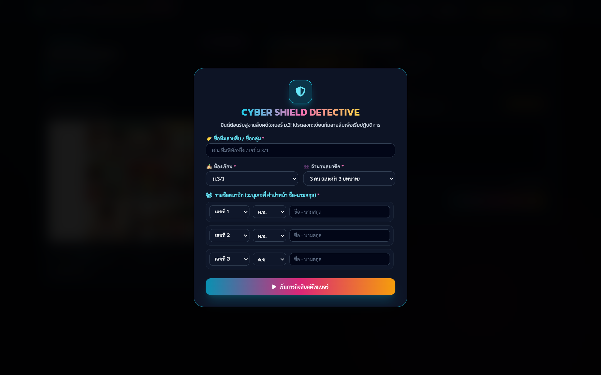
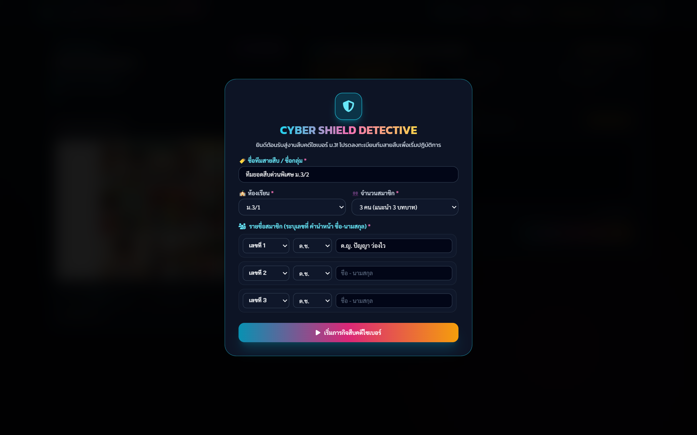

# 📖 คู่มือการใช้งานและโครงสร้างระบบ: Cyber Shield Detective (เวอร์ชัน Fast-Track 3 คดี - `cyber_shield_detective_3.html`)

**Cyber Shield Detective: Fast-Track (3 คดี)** คือ เวอร์ชันปรับแต่งพิเศษที่ออกแบบมาเพื่อ **การจัดการเรียนรู้ในคาบเรียนเดี่ยว 50 นาที** โดยคัดสรร 3 คดีหลักที่เป็นตัวแทนสำคัญของ พ.ร.บ.คอมพิวเตอร์ 2560 และ PDPA 2562 (รวม 90 คะแนน) พร้อมการประเมินผลอัตนัยด้วย Google Gemini AI และระบบแสดงผลคะแนนสดสำหรับครู

---

## 🌟 1. ภาพรวมและวัตถุประสงค์ (Overview & Learning Objectives)

### 🎯 วัตถุประสงค์การเรียนรู้
1. **กระชับเวลาการเรียนรู้ (Time-Optimized Active Learning)**: จัดกิจกรรมสืบคดีครบ 3 บทบาท (กฎหมาย, บรรเทาภัย, ป้องกัน) ได้เสร็จสิ้นภายในคาบเรียน 50 นาที
2. **มุ่งเน้น 3 ฐานความผิดยอดนิยมในชีวิตประจำวันของวัยรุ่น**:
   - **คดีที่ 1 (เข้าถึงระบบ/ข้อมูลผู้อื่นโดยมิชอบ)**: มาตรา 5 และ มาตรา 7 (การแอบใช้ไอดีเกม/ส่องแชทส่วนตัว)
   - **คดีที่ 2 (ข่าวปลอม/ฟิชชิ่ง)**: มาตรา 14(1) หรือ 14(2) (การแชร์ลิงก์หลอกลวงหรือ Fake News)
   - **คดีที่ 3 (การตัดต่อภาพ/ละเมิด PDPA)**: มาตรา 16 หรือ PDPA Sensitive Data (การตัดต่อรูปเพื่อนล้อเลียนในโซเชียล)
3. **ส่งออกรายงานครูพอดี 1 หน้า A4**: คะแนนและผลการประเมิน 3 คดีสามารถพิมพ์รายงานสรุปผลการเรียนรู้รายบุคคลได้พอดี 1 หน้า A4 (Single-Page A4 PDF)

### 👥 โครงสร้างคะแนนและเวลาที่เหมาะสม
- **จำนวนคดี**: 3 คดีหลัก
- **คะแนนเต็มรวม**: 90 คะแนน (คดีละ 30 คะแนน = บทบาทละ 10 คะแนน)
- **เวลาที่แนะนำ**: 40 - 50 นาที (ลงทะเบียน 5 นาที + เล่น 30 นาที + สรุปบทเรียน 10 นาที)

---

## 👨‍🏫 2. สิ่งที่ครู/ผู้สอนควรชี้แนะแก่นักเรียน (Pedagogical Guidelines)

### 💡 คีย์เวิร์ดและสิ่งที่ต้องแนะนำก่อนเริ่มเกม
1. **การบริหารเวลา (Time Management)**: เนื่องจากมีเวลาเพียง 50 นาที แนะนำให้นักเรียนแบ่งเวลาคดีละไม่เกิน 8-10 นาที (บทบาทละ 2-3 นาที)
2. **การเน้นความกระชับและตรงประเด็น**: ตอบให้ตรงประเด็น ไม่ต้องเกริ่นนำยาว ระบุชื่อมาตรา เหตุผล และอัตราโทษให้ชัดเจน
3. **การจับคู่กับ Command Center 3 คดี**: ครูควรเปิดหน้าจอ `cyber_shield_teacher_3.html` ควบคู่บนจอโปรเจกเตอร์เพื่อให้นักเรียนเห็นสถานะคะแนนและเกิดแรงจูงใจ (Gamification)

---

## 📸 3. ขั้นตอนการใช้งานทีละ Step พร้อมภาพสกรีนช็อตจริง (Step-by-Step Walkthrough)

### 🔹 Step 1: ลงทะเบียนทีมแบบ Fast-Track (Registration Screen)
นักเรียนกรอกชื่อทีม, ห้อง, เลขที่ และสมาชิกในทีม จากนั้นกดปุ่มเริ่มภารกิจ Fast-Track


*ภาพที่ 1: หน้าต่างลงทะเบียนข้อมูลทีมในเวอร์ชัน Fast-Track 3 คดี*

---

### 🔹 Step 2: อ่านการ์ตูนคดีและข้อเท็จจริง (Case Synopsis & 9-Panel Comic)
นักเรียนศึกษาหลักฐานและการ์ตูน 9 ช่องของทั้ง 3 คดีที่คัดสรรมาเป็นพิเศษ


*ภาพที่ 2: หน้าจอแสดงการ์ตูนช่องและแถบนำทาง 3 คดีหลัก*

---

### 🔹 Step 3: วิเคราะห์และส่งตรวจ 3 บทบาท (Active Role Form & AI Scoring)
นักเรียนวิเคราะห์ทีละบทบาท กรอกข้อความอย่างน้อย 20 ตัวอักษร แล้วกดส่งตรวจเพื่อรับคะแนนสด 10 คะแนนต่อบทบาท


*ภาพที่ 3: กล่องพิมพ์คำตอบและประเมินผลอัตนัยทันทีด้วย Gemini AI*

---

## 📊 4. เกณฑ์การประเมินรูบริก 4 ระดับ (Rubric Matrix - 90 คะแนนรวม)

| ระดับคุณภาพ | ช่วงคะแนนรวม (เต็ม 90) | เกณฑ์การตัดสินเชิงคุณภาพ |
|---|:---:|---|
| **ยอดเยี่ยม (Expert Detective)** | **75 - 90 คะแนน** | วิเคราะห์มาตราความผิดถูกต้องครบทั้ง 3 คดี, เสนอมาตรการระงับเหตุเฉพาะหน้าได้อย่างเป็นรูปธรรม, และกำหนดแนวทางป้องกันเชิงระบบได้ถูกต้องตามหลัก DQ |
| **ดี (Senior Detective)** | **60 - 74 คะแนน** | ระบุมาตราความผิดถูกต้องเกือบครบถ้วน, ระงับเหตุได้ถูกต้อง แต่อาจขาดรายละเอียดเรื่องอัตราโทษหรือข้อกฎหมายบางประเด็น |
| **พอใช้ (Junior Detective)** | **45 - 59 คะแนน** | เข้าใจบริบทคดีและระบุมาตราถูกเป็นบางคดี, วิธีการแก้ไขและป้องกันยังเป็นแนวคิดทั่วไป |
| **ปรับปรุง (Trainee)** | **ต่ำกว่า 45 คะแนน** | ระบุมาตราความผิดคลาดเคลื่อนเกินกว่ากึ่งหนึ่ง, ไม่สามารถเสนอแนวทางแก้ไขหรือป้องกันที่ตรงจุดได้ |

---

## 💻 5. ผ่าสถาปัตยกรรมโค้ดและการทำงานเชิงลึก (Detailed Code Breakdown)

### 🧱 โครงสร้างข้อมูลคดี Fast-Track
ในไฟล์ `cases_data.js` มีการกำหนด Array สำหรับโหมด 3 คดีโดยเฉพาะ:
```javascript
// คัดสรร 3 คดีหลักสำหรับ Fast-Track Mode
const FAST_TRACK_CASE_IDS = [1, 4, 6]; // คดีไอดีเกม (ม.5/7), คดีฟิชชิ่ง (ม.14), คดีตัดต่อภาพ (ม.16)

function getFastTrackCases() {
    return ALL_CASES.filter(c => FAST_TRACK_CASE_IDS.includes(c.id));
}
```

### ⚡ การคำนวณคะแนนและการซิงค์ Supabase
- เมื่อนักเรียนตรวจครบ 3 คดี (9 บทบาท) ฟังก์ชัน `finalizeFastTrackGame()` จะถูกเรียกเพื่อสร้าง Canvas Digital Certificate และส่งข้อมูลสถานะ `completed` ไปยัง Supabase Table `game_sessions_3` เพื่อให้ครูดึงข้อมูลในหน้า `cyber_shield_teacher_3.html`

---

## ⚠️ 6. กรณีพิเศษ การตรวจจับข้อผิดพลาด และวิธีแก้ไข (Edge Cases & Troubleshooting)

| ข้อผิดพลาดที่อาจพบ | การจัดการของระบบ | ข้อแนะนำสำหรับครู |
|---|---|---|
| **นักเรียนทำไม่ทันในเวลา 50 นาที** | ระบบจะบันทึกคะแนนทุกบทบาทที่ส่งตรวจแล้วทันที | ครูสามารถสั่งจบเกมและดูคะแนนเฉพาะบทบาทที่ทำเสร็จผ่าน Dashboard 3 คดีได้ |
| **เครือข่ายกระตุกระหว่างประเมินผล** | มีระบบ Auto-Retry และ Heuristic Fallback ในเครื่อง | ไม่ต้องให้นักเรียนรีเฟรชหน้าจอ ให้กดปุ่มส่งตรวจซ้ำได้ทันที |
