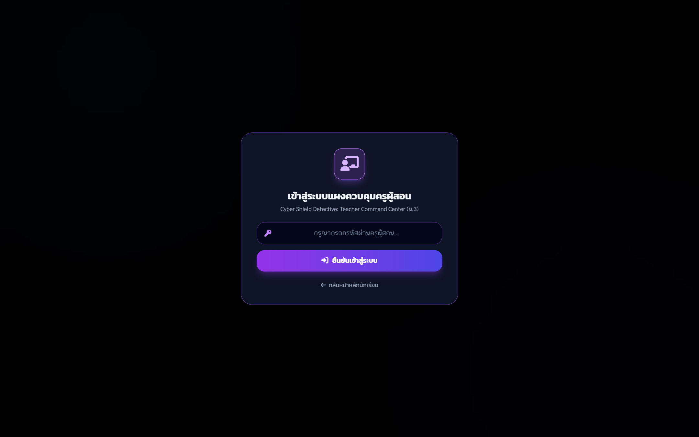

# 📖 คู่มือการใช้งานและโครงสร้างระบบ: Teacher Command Center 6 คดี (`cyber_shield_teacher.html`)

**Teacher Command Center (6 คดี)** คือ ศูนย์บัญชาการและแดชบอร์ดมอนิเตอร์คะแนนสดสำหรับครูผู้สอน เชื่อมต่อฐานข้อมูล **Supabase Realtime** ช่วยให้ครูติดตามความก้าวหน้าของนักเรียนทุกกลุ่มได้แบบวินาทีต่อวินาที ตรวจสอบคำตอบอัตนัยรายบทบาท ปรับแก้คะแนน (Override) พร้อมข้อคิดเห็น และพิมพ์รายงานสรุปผล PDF สวยงามระดับมืออาชีพ

---

## 🌟 1. ภาพรวมและวัตถุประสงค์ (Overview & Learning Objectives)

### 🎯 วัตถุประสงค์หลัก
1. **มอนิเตอร์การเรียนรู้แบบเรียลไทม์ (Live Formative Monitoring)**: เห็นสถานะการส่งคำตอบและคะแนนของทุกกลุ่มสดทันทีโดยไม่ต้องกดรีเฟรช
2. **ระบบการประเมินแบบผสมผสาน (Human-in-the-loop AI Grading)**: ครูสามารถตรวจสอบเหตุผลที่ Gemini AI ให้คะแนน และสามารถ Override แก้ไขคะแนนพร้อมใส่ Teacher Note ได้
3. **ส่งออกรายงานสรุปผลการประเมิน (Official PDF Report Export)**: จัดหน้าพิมพ์ A4 Portrait สำหรับเก็บเป็นหลักฐานการวัดและประเมินผลตามตัวชี้วัด ว 4.2 ม.3

### 👥 ผู้ใช้งานและสิทธิ์การเข้าถึง
- **ครูผู้สอน / กรรมการประเมิน**: ล็อกอินผ่าน Passcode เพื่อเข้าถึงข้อมูลคำตอบเชิงลึก
- **โหมดเปิดจอหน้าชั้นเรียน (Presentation Mode)**: ซ่อนปุ่มจัดการเพื่อฉายเฉพาะตารางคะแนนและ Leaderboard กระตุ้นการมีส่วนร่วม

---

## 👨‍🏫 2. สิ่งที่ครู/ผู้สอนควรชี้แนะและใช้งานในห้องเรียน (Pedagogical Guidelines)

### 💡 ขั้นตอนการจัดกิจกรรมในห้องเรียน
1. **ก่อนเริ่มคาบ**: ครูเปิดหน้า `cyber_shield_teacher.html` กรอก Passcode และตรวจสอบสถานะ WebSocket Realtime เป็นจุดสีเขียว (`Connected`)
2. **ระหว่างนักเรียนทำภารกิจ**: สังเกตแถบ Progress Bar หากมีกลุ่มใดติดอยู่ที่คดีเดิมนานเกิน 15 นาที ครูสามารถเดินไปแนะนำ (Scaffolding) ได้ตรงจุด
3. **การตรวจสอบความผิดปกติ (Academic Integrity)**: ตรวจสอบแถบ Warning Count หากกลุ่มใดมีการสลับหน้าจอ (Tab Switches) สูงผิดปกติ ให้สอบถามและตรวจสอบคำตอบ

---

## 📸 3. ขั้นตอนการใช้งานทีละ Step พร้อมภาพสกรีนช็อตจริง (Step-by-Step Walkthrough)

### 🔹 Step 1: ยืนยันรหัสผ่านครูผู้สอน (Passcode Authentication)
เมื่อเปิดหน้าเว็บ ระบบจะแสดง Modal ป้องกันข้อมูลส่วนบุคคล ให้ครูกรอก Passcode เพื่อเข้าสู่ห้องควบคุม


*ภาพที่ 1: หน้าต่างยืนยันรหัสผ่านสำหรับครูผู้สอน*

---

### 🔹 Step 2: แผงควบคุมคะแนนสด (Realtime Command Center Dashboard)
เมื่อเข้าสู่ระบบ จะพบกับตารางคะแนนรวม, ตัวกรองห้องเรียน/สถานะ, ปุ่มส่งออก PDF, และตารางแสดงรายชื่อทีม สมาชิก ความก้าวหน้ารายคดี และคะแนนรวม (เต็ม 180)


*ภาพที่ 2: แผงควบคุมสรุปผลคะแนนสด มอนิเตอร์ 6 คดี พร้อมเครื่องมือกรองและส่งออกรายงาน*

---

## 📊 4. เกณฑ์การประเมินและการปรับแก้คะแนนของครู (Teacher Evaluation & Override Rubric)

| สถานะการตรวจ AI | ความเห็นครู (Teacher Action) | แนวทางการปรับคะแนน (Override Guide) |
|---|---|---|
| **AI ให้คะแนนเต็ม (10/10) ตรงตามรูบริก** | อนุมัติคะแนนตาม AI | คงคะแนนเดิม ไม่ต้องแก้ไข |
| **นักเรียนตอบถูกหลักการแต่ใช้ภาษาพูด/คำย่อ** | AI อาจหักคะแนนส่วนรูปประโยค | ครูสามารถปรับเพิ่ม (+1 ถึง +2 คะแนน) พร้อมใส่เหตุผล "ตอบใจความสำคัญครบถ้วน" |
| **พบการคัดลอกหรือคำตอบไม่สมเหตุสมผล** | AI อาจตรวจจับคำสำคัญหลงทาง | ครูสามารถ Override ลดคะแนนเหลือ 0-2 คะแนน พร้อมใส่ข้อเสนอแนะตักเตือน |

---

## 💻 5. ผ่าสถาปัตยกรรมโค้ดและการทำงานเชิงลึก (Detailed Code Breakdown)

### 🔌 การเชื่อมต่อ Supabase Realtime Subscription
```javascript
// ซับสไครบ์การเปลี่ยนแปลงข้อมูลใน Table game_sessions_6
function initSupabaseRealtime() {
    const channel = supabaseClient
        .channel('public:game_sessions_6')
        .on('postgres_changes', {
            event: '*',
            schema: 'public',
            table: 'game_sessions_6'
        }, (payload) => {
            console.log('Realtime Event Received:', payload);
            handleIncomingSessionUpdate(payload);
        })
        .subscribe((status) => {
            updateConnectionBadge(status === 'SUBSCRIBED');
        });
}
```

### 📄 ระบบจัดพิมพ์รายงาน PDF (`@media print`)
- มีการจัดสไตล์ CSS สำหรับกระดาษ A4 โดยเฉพาะ:
  - กำหนด `@page { size: A4 portrait; margin: 7mm 6mm; }`
  - ซ่อนส่วนที่ไม่ต้องการพิมพ์ เช่น Navbar, ปุ่มจัดการ, Modal ด้วยคลาส `.no-print`
  - ขยายตารางสรุปคำตอบให้พอดีหน้ากระดาษอย่างคมชัด

---

## ⚠️ 6. กรณีพิเศษ การตรวจจับข้อผิดพลาด และวิธีแก้ไข (Edge Cases & Troubleshooting)

| ปัญหาที่อาจพบ | การแก้ไขของระบบ | วิธีการแก้ปัญหาเฉพาะหน้า |
|---|---|---|
| **สถานะ Realtime ขึ้นสีแดง (Disconnected)** | ระบบมี Polling สำรองอัตโนมัติทุก 10 วินาที | กดปุ่ม `🔄 โหลดข้อมูลใหม่` เพื่อดึงข้อมูลล่าสุดจาก REST API |
| **พิมพ์รายงาน PDF แล้วตารางล้นหน้า** | ระบบใช้ CSS Break-Inside Avoid | ปรับ Scale ในหน้าต่าง Print Preview ของเบราว์เซอร์เป็น 90% - 95% |
