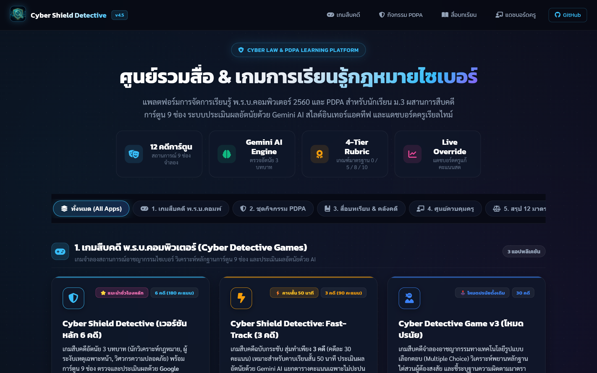
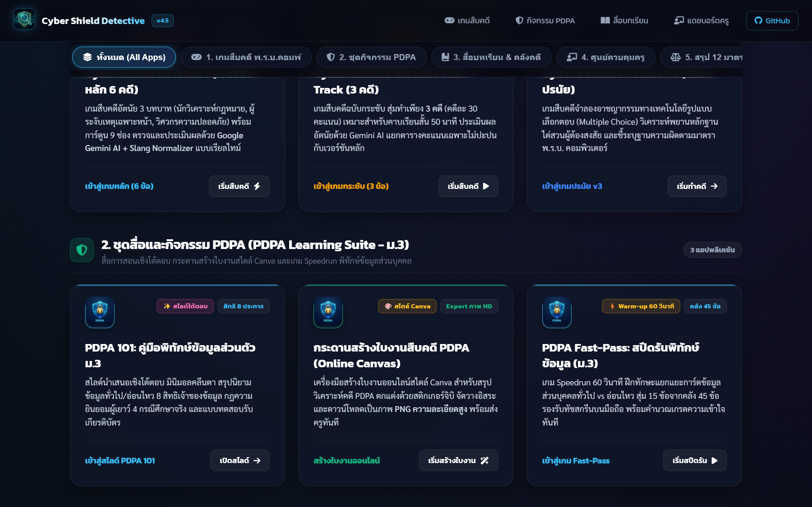
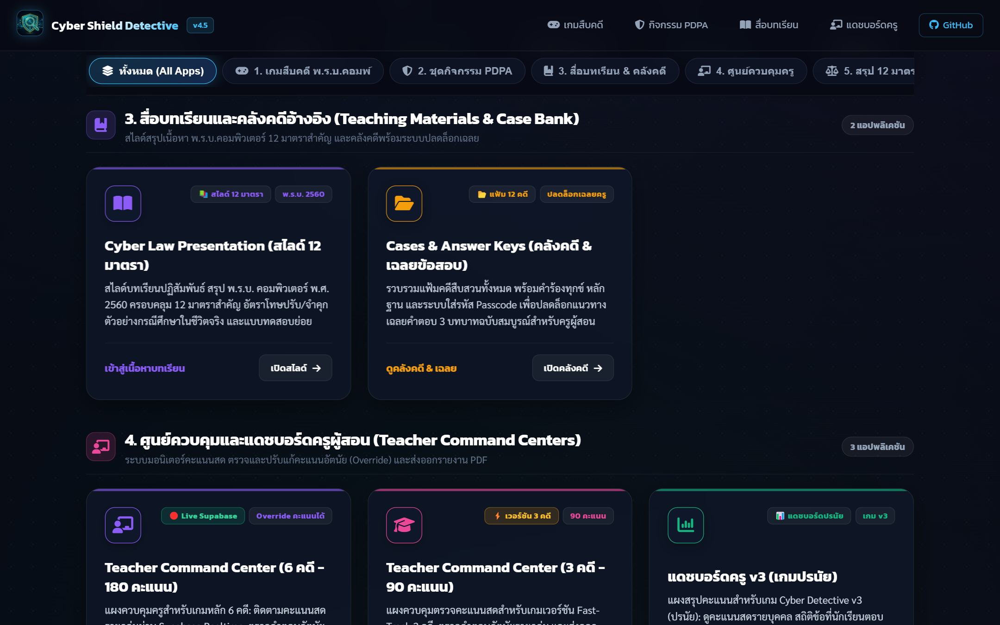

# 📖 คู่มือการใช้งานและโครงสร้างระบบ: Main Portal Hub (`index.html`)

หน้า **Main Portal Hub (`index.html`)** คือประตูบานแรกและศูนย์กลางระบบนิเวศการเรียนรู้ทั้งหมดของแพลตฟอร์ม **Cyber Shield Detective** ทำหน้าที่รวบรวม จัดหมวดหมู่ และเปิดทางเข้าถึงสื่อการสอน เกมสืบคดี กระดานใบงาน สไลด์อินเทอร์แอคทีฟ และระบบจัดการคะแนนสำหรับครูผู้สอน

---

## 🌟 1. ภาพรวมและวัตถุประสงค์ (Overview & Learning Objectives)

### 🎯 วัตถุประสงค์หลัก
1. **ศูนย์กลางระบบนิเวศสื่อการสอน (Centralized Navigation Hub)**: รวมทุกเครื่องมือทั้ง 12 แอปพลิเคชันไว้ในที่เดียว พร้อมระบบ Filter และ Badges แยกสถานะระบบ
2. **สร้างความพร้อมก่อนเข้าสู่บทเรียน (Orientation & DQ Baseline)**: แนะนำภาพรวม พ.ร.บ.คอมพิวเตอร์ 2560 และ PDPA 2562 แก่นักเรียนระดับชั้นมัธยมศึกษาปีที่ 3
3. **รองรับ SEO & Accessibility สากล**: มีการฝัง Microdata JSON-LD ครบ 5 ประเภท (WebSite, EducationalOrganization, BreadcrumbList, FAQPage, ItemList) และการออกแบบที่โหลดเร็ว Sub-second (< 0.8s)

### 👥 กลุ่มเป้าหมายและบริบทที่แนะนำ
- **นักเรียน ม.3**: ใช้เลือกเข้าสู่เกมสืบคดี, สไลด์ทบทวน, และกระดานสร้างใบงาน
- **ครูผู้สอน / ศึกษานิเทศก์**: ใช้เข้าสู่ห้องบัญชาการครู (Teacher Command Center), คลังคดีพร้อมเฉลย (Cases Reference) และดูสถิติภาพรวม

---

## 👨‍🏫 2. สิ่งที่ครู/ผู้สอนควรชี้แนะแก่นักเรียน (Pedagogical Guidelines)

### 💡 คีย์เวิร์ดและประเด็นสำคัญที่ต้องเน้น
- **การนำทางสู่บทเรียน**: ชี้แจงให้นักเรียนทราบว่าแพลตฟอร์มประกอบด้วย 4 หมวดหลัก (เกมสืบคดี พ.ร.บ., กิจกรรม PDPA, สื่อการสอน & สไลด์, เครื่องมือจัดการสำหรับครู)
- **การแยกแยะระหว่าง พ.ร.บ.คอมพิวเตอร์ vs PDPA**:
  - *พ.ร.บ.คอมพิวเตอร์ 2560* = กฎหมายอาญา ลงโทษผู้กระทำความผิดต่อระบบ/ข้อมูล (แฮก, สแปม, ข่าวปลอม, ตัดต่อภาพ)
  - *PDPA 2562* = กฎหมายคุ้มครองข้อมูลส่วนบุคคล (ข้อมูลทั่วไป vs ข้อมูลอ่อนไหว และสิทธิ 8 ประการ)

### ⚠️ จุดที่นักเรียนมักสับสนบ่อย (Common Misconceptions)
- **การเลือกเวอร์ชันเกม**: นักเรียนมักสับสนระหว่าง *เวอร์ชัน 6 คดี (หลัก - 180 คะแนน)* สำหรับกิจกรรมเต็มคาบ 100 นาที กับ *เวอร์ชัน Fast-Track 3 คดี (90 คะแนน)* สำหรับคาบสั้น 50 นาที ครูผู้สอนควรแจ้งให้นักเรียนเลือกคลิกการ์ดให้ตรงกับแผนการสอนในคาบนั้น

---

## 📸 3. ขั้นตอนการใช้งานทีละ Step พร้อมภาพสกรีนช็อตจริง (Step-by-Step Walkthrough)

### 🔹 Step 1: หน้าแรกและส่วนหัวระบบ (Hero Section & Stats Ribbon)
เมื่อผู้ใช้งานเข้าสู่หน้าเว็บ จะพบกับแบนเนอร์ Hero Title, สถิติรวมของระบบ (12 คดีหลัก, 2 กฎหมาย, 45 คลังข้อสอบสปีดรัน, ตรวจคำตอบด้วย AI)


*ภาพที่ 1: ส่วน Hero Section และแถบสถิติภาพรวมแพลตฟอร์ม (Stats Ribbon)*

---

### 🔹 Step 2: แถบตัวกรองและตารางการ์ดแอปพลิเคชัน (Filter Tabs & App Grid)
ผู้ใช้สามารถกดแท็บตัวกรองเพื่อเลือกดูเฉพาะหมวดหมู่ที่ต้องการ เช่น `🎮 เกมสืบคดี`, `🛡️ กิจกรรม PDPA`, `📖 สื่อบทเรียน`, หรือ `👩‍🏫 แดชบอร์ดครู`


*ภาพที่ 2: ระบบ Filter Tabs และการ์ดเข้าสู่ระบบต่างๆ พร้อมสีประจำหมวดหมู่ (Theme Accents)*

---

### 🔹 Step 3: สรุป 12 มาตราสำคัญ & คำถามที่พบบ่อย (Legal Quick Reference & FAQ)
ด้านล่างของหน้าเว็บมีตารางสรุป 12 มาตรา พ.ร.บ.คอมพิวเตอร์ พร้อมอัตราโทษ และ Accordion FAQ สำหรับค้นหาข้อสงสัยเบื้องต้น


*ภาพที่ 3: ส่วนสรุป 12 มาตราและคำถามที่พบบ่อย (Interactive FAQ Accordion)*

---

## 📊 4. เกณฑ์การประเมินรูบริก (Rubric Matrix for Portal Usability & Orientation)

| ประเด็นการประเมิน | ระดับ 4 (ดีเยี่ยม) | ระดับ 3 (ดี) | ระดับ 2 (พอใช้) | ระดับ 1 (ปรับปรุง) |
|---|---|---|---|---|
| **1. ความเข้าใจโครงสร้างระบบนิเวศ** | อธิบายความเชื่อมโยงของเครื่องมือทั้ง 4 หมวดและเลือกเข้าใช้งานได้ตรงภารกิจ 100% | เข้าใจเครื่องมือหลักและเลือกเข้าใช้งานได้ถูกต้องเกือบทั้งหมด | สับสนระหว่างเวอร์ชัน 6 คดีและ 3 คดีเล็กน้อย ต้องได้รับคำแนะนำ | ไม่เข้าใจโครงสร้างระบบ ไม่สามารถเข้าห้องเรียนหรือเกมได้เอง |
| **2. การสืบค้นฐานความผิด 12 มาตรา** | ใช้ Quick Reference Table ในหน้า Portal ค้นหามาตราและอัตราโทษได้ถูกต้องแม่นยำในเวลาไม่เกิน 1 นาที | ค้นหามาตราและโทษได้ถูกต้องในเวลา 2 นาที | ค้นหาพบแต่ระบุอัตราโทษหรือองค์ประกอบผิดบางส่วน | ไม่สามารถสืบค้นหรือจับคู่ฐานความผิดได้ |
| **3. การมีปฏิสัมพันธ์กับ FAQ & บทเรียน** | ศึกษา FAQ ครบถ้วนและสามารถนำคำตอบไปใช้อ้างอิงในการทำข้อสอบ/สืบคดีได้ | อ่าน FAQ และเข้าใจความแตกต่างของ พ.ร.บ.คอมฯ กับ PDPA | อ่านเฉพาะบางข้อ แต่ตอบคำถามเบื้องต้นได้ | ไม่อ่านรายละเอียดและไม่สามารถแยกแยะกฎหมายได้ |

---

## 💻 5. ผ่าสถาปัตยกรรมโค้ดและการทำงานเชิงลึก (Detailed Code Breakdown)

### 🧱 โครงสร้าง DOM และส่วนประกอบสำคัญ (`index.html`)
- **Top Sticky Navbar (`<header class="top-navbar">`)**:
  - `class="nav-brand"`: โลโก้ WebP fallback PNG พร้อม Badge เวอร์ชัน `v4.5`
  - `class="nav-links"`: ลิงก์ Smooth Scroll สู่ Anchor IDs (`#games`, `#pdpa`, `#learning`, `#teacher`)
- **Interactive Filter Bar (`<div class="filter-tabs-container">`)**:
  - แท็บปุ่ม `class="filter-tab"` รองรับ Data Attributes (`data-filter="all"`, `data-filter="games"`, `data-filter="pdpa"`, `data-filter="slides"`, `data-filter="teacher"`)
- **Application Grid Cards (`<div class="cards-grid">`)**:
  - การ์ดแต่ละใบกำหนด CSS Custom Properties ผ่าน Class เช่น `.theme-cyan`, `.theme-amber`, `.theme-emerald`, `.theme-pink`, `.theme-purple`
  - มี Interactive Launch Button ที่เปลี่ยนสีและเลื่อน Icon ลูกศรเมื่อ `:hover`

### ⚙️ กลไก JavaScript Logic
```javascript
// ฟังก์ชันจัดการ Filter Tabs แบบ Realtime Smooth Transition
document.querySelectorAll('.filter-tab').forEach(tab => {
    tab.addEventListener('click', () => {
        // 1. สลับ Active State ของปุ่ม
        document.querySelectorAll('.filter-tab').forEach(t => t.classList.remove('active'));
        tab.classList.add('active');

        // 2. ดึงค่า Filter Category
        const category = tab.getAttribute('data-filter');
        const sections = document.querySelectorAll('.category-section');

        // 3. กรอง Section แสดงผล
        sections.forEach(sec => {
            if (category === 'all' || sec.id === category) {
                sec.style.display = 'flex';
                sec.style.opacity = '0';
                setTimeout(() => sec.style.opacity = '1', 50);
            } else {
                sec.style.display = 'none';
            }
        });
    });
});
```

---

## ⚠️ 6. กรณีพิเศษ การตรวจสอบ และวิธีแก้ไข (Edge Cases & Troubleshooting)

| ปัญหา / เหตุการณ์ | สาเหตุที่เป็นไปได้ | แนวทางการแก้ไขและ Fallback |
|---|---|---|
| **รูปภาพและไอคอนไม่แสดงบนเครือข่ายโรงเรียน** | ระบบเครือข่ายบล็อก Cloudflare CDN หรือ CDN ภายนอก | โค้ดมี Fallback inline SVG และรูปภาพ Local PNG/WebP ใน `favicon.png` สำรองอัตโนมัติ |
| **กดปุ่มเข้าเกมแล้วหน้าเว็บไม่โหลด** | เบราว์เซอร์เก่าไม่อ่าน JavaScript ES6 | ออกแบบให้ Hyperlink (`<a href="...">`) ทำงานเป็น Native Link โดยตรง ไม่พึ่งพา JS router |
| **การแสดงผลผิดเพี้ยนบนมือถือ/แท็บเล็ต** | หน้าจอความกว้างน้อยกว่า 768px | มี Media Query จัด Grid เป็น 1 คอลัมน์ และซ่อน Nav Links เพื่อลดความแออัดของ UI |
