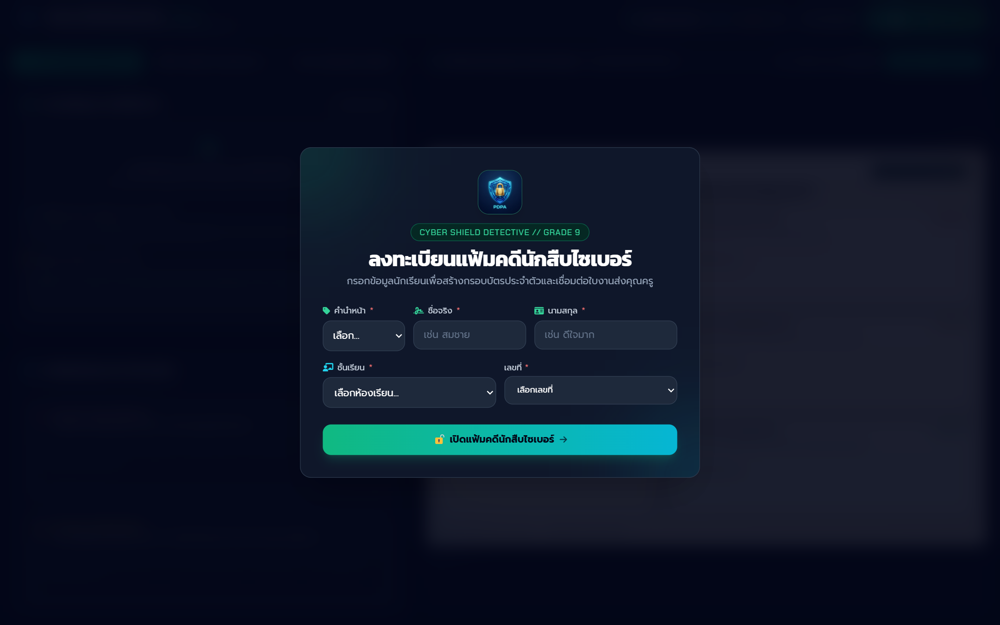

# 📖 คู่มือการใช้งานและโครงสร้างระบบ: กระดานสร้างใบงาน PDPA Canvas (`pdpa_assignment_board.html`)

**กระดานสร้างใบงานสืบคดี PDPA ออนไลน์ (Interactive Canvas Assignment Board - `pdpa_assignment_board.html`)** คือ สตูดิโอสร้างใบงานดิจิทัลสไตล์ Canva ให้นักเรียนได้สรุปวิเคราะห์กรณีศึกษา PDPA แบบ Visual Learning จัดวาง Sticky Notes, ลากวางสติกเกอร์ Badge, พิมพ์สรุปข้อเท็จจริง และส่งออกเป็น **ภาพ PNG ความละเอียดสูงระดับ HD / PDF** เพื่อส่งครู

---

## 🌟 1. ภาพรวมและวัตถุประสงค์ (Overview & Learning Objectives)

### 🎯 วัตถุประสงค์การเรียนรู้
1. **การสังเคราะห์องค์ความรู้เชิงภาพ (Visual Synthesis & Creative DQ)**: เปลี่ยนความรู้กฎหมายที่เป็นตัวหนังสือ ให้กลายเป็น Mindset & Canvas สรุปแผนผังความคุ้มครองข้อมูล
2. **การบูรณาการความคิดสร้างสรรค์ (Craft & Design Integration)**: นักเรียนสามารถเลือกพาเลทสี, แบบอักษรไทย (Prompt, Mali, Itim, Bai Jamjuree), และจัดวางเลย์เอาต์ใบงานตามสไตล์ของตนเอง
3. **ส่งออกผลงานพร้อมประเมิน (Instant HD Export)**: เรนเดอร์เป็นภาพ PNG 300 DPI ผ่าน `html2canvas` สำหรับนำไปส่งใน Google Classroom หรือพิมพ์ติดบอร์ดโครงงาน

---

## 👨‍🏫 2. สิ่งที่ครู/ผู้สอนควรชี้แนะแก่นักเรียน (Pedagogical Guidelines)

### 💡 แนวทางการจัดการเรียนรู้
- **การมอบหมายงานกลุ่ม/เดี่ยว**: กำหนดให้นักเรียนเลือก 1 คดีจาก 4 กรณีศึกษา PDPA เพื่อนำมาวิเคราะห์บนบอร์ด
- **3 องค์ประกอบหลักที่ต้องมีในใบงาน**:
  1. *ข้อมูลส่วนบุคคลที่เกี่ยวข้อง* (ระบุว่าเป็นข้อมูลทั่วไปหรือข้อมูลอ่อนไหว)
  2. *การกระทำที่เข้าข่ายละเมิด* (ไม่มีความยินยอม หรือใช้ผิดวัตถุประสงค์)
  3. *แนวทางแก้ไขและข้อตกลงร่วมกัน* (มาตรการทางเทคนิคและข้อควรปฏิบัติ)

---

## 📸 3. ขั้นตอนการใช้งานทีละ Step พร้อมภาพสกรีนช็อตจริง (Step-by-Step Walkthrough)

### 🔹 Step 1: เลือกเทมเพลตและพิมพ์ข้อมูลผู้จัดทำ (Canvas Header & Setup)
นักเรียนกรอกชื่อ-นามสกุล, เลขที่, ห้อง, และเลือกหัวข้อกรณีศึกษา PDPA ที่ต้องการวิเคราะห์


*ภาพที่ 1: หน้าจอการทำงานของกระดานใบงานออนไลน์พร้อมกล่องเครื่องมือและส่วนหัวใบงาน*

---

### 🔹 Step 2: เติมเนื้อหาและจัดตกแต่งบอร์ด (Content Editing & Craft Tools)
พิมพ์วิเคราะห์ข้อมูลทั่วไป/อ่อนไหว, พฤติกรรมที่ผิด, ข้อแนะนำ, และแปะสติกเกอร์ตกแต่ง


*ภาพที่ 2: ส่วนกรอกรายละเอียดการวิเคราะห์คดีและการจัดหมวดหมู่ข้อมูลส่วนบุคคล*

---

## 📊 4. เกณฑ์การประเมินรูบริกสำหรับใบงาน (Canvas Assignment Rubric - เต็ม 20 คะแนน)

| มิติการประเมิน | ดีเยี่ยม (5 คะแนน) | ดี (4 คะแนน) | พอใช้ (3 คะแนน) | ปรับปรุง (1-2 คะแนน) |
|---|---|---|---|---|
| **1. ความถูกต้องของเนื้อหากฎหมาย** | จำแนกข้อมูลทั่วไป/อ่อนไหว และระบุฐานความผิด PDPA ได้ถูกต้องสมบูรณ์ | ระบุข้อมูลและฐานความผิดได้ถูกต้องเกือบหมด ขาดรายละเอียดเล็กน้อย | ระบุถูกบางส่วน มีข้อผิดพลาดในข้อมูลอ่อนไหว | เนื้อหาคลาดเคลื่อน ไม่ตรงกับหลักการ PDPA |
| **2. ความคิดสร้างสรรค์และการออกแบบ** | จัดวางองค์ประกอบสวยงาม อ่านง่าย ใช้สีและฟอนต์สื่อความหมายชัดเจน | จัดวางได้ดี เป็นระเบียบ สวยงาม | จัดวางพอใช้ ตัวหนังสือบางส่วนซ้อนทับกัน | ไม่จัดระเบียบ อ่านยาก ขาดการตกแต่ง |
| **3. ข้อเสนอแนะและการแก้ไขปัญหา** | เสนอแนวทางป้องกันและเยียวยาได้เป็นรูปธรรม ปฏิบัติได้จริง | เสนอแนวทางแก้ไขได้ดี แต่อาจกว้างไปเล็กน้อย | เสนอแนวทางทั่วไป เช่น บอกให้ขอโทษ | ไม่ระบุแนวทางแก้ไขปัญหา |
| **4. ความสมบูรณ์และการส่งงานตรงเวลา** | กรอกข้อมูลครบทุกช่อง ส่งออกไฟล์ PNG คมชัดสมบูรณ์ | กรอกข้อมูลครบถ้วน ส่งงานตรงเวลา | ขาดข้อมูลบางช่อง | ขาดข้อมูลสำคัญหลายส่วน |

---

## 💻 5. ผ่าสถาปัตยกรรมโค้ดและการทำงานเชิงลึก (Detailed Code Breakdown)

### 📸 การ Export ภาพความละเอียดสูงด้วย `html2canvas`
```javascript
// เรนเดอร์ Canvas DOM เป็นภาพ PNG ความละเอียดสูง (Scale 2x)
async function exportBoardToPNG() {
    const boardElement = document.getElementById('assignment-board-canvas');
    showLoadingSpinner(true);

    try {
        const canvas = await html2canvas(boardElement, {
            scale: 2, // เพิ่มความละเอียด 2 เท่าสำหรับพิมพ์
            useCORS: true,
            backgroundColor: '#0F172A',
            logging: false
        });

        const imageUri = canvas.toDataURL('image/png');
        const link = document.createElement('a');
        link.download = `PDPA_Assignment_${studentName || 'Student'}.png`;
        link.href = imageUri;
        link.click();

        // ยิง Confetti เฉลิมฉลอง
        confetti({ particleCount: 100, spread: 70, origin: { y: 0.6 } });
    } catch (err) {
        console.error('Export Error:', err);
    } finally {
        showLoadingSpinner(false);
    }
}
```

---

## ⚠️ 6. กรณีพิเศษ การตรวจจับข้อผิดพลาด และวิธีแก้ไข (Edge Cases & Troubleshooting)

| ปัญหา | สาเหตุ | การแก้ไข |
|---|---|---|
| **ภาพที่ส่งออกเบลอหรือไม่ติดฟอนต์ภาษาไทย** | html2canvas เรนเดอร์ก่อนที่ฟอนต์เว็บจะเรนเดอร์สมบูรณ์ | ระบบใส่ Timeout หน่วงเวลา 300ms และตั้งค่า `scale: 2` เพื่อให้ภาพคมชัดระดับ HD |
| **ข้อความยาวล้นกรอบ Canvas** | นักเรียนพิมพ์ข้อความยาวเกินขนาดกล่อง | ระบบมี CSS `overflow-wrap: break-word` และจำกัดความสูงอัตโนมัติ |
