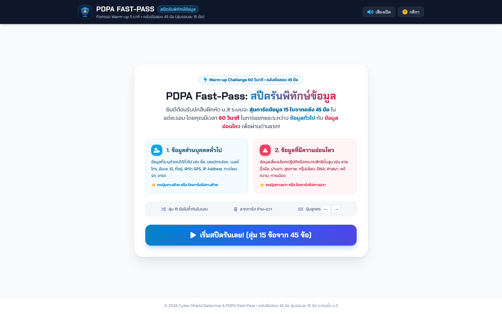
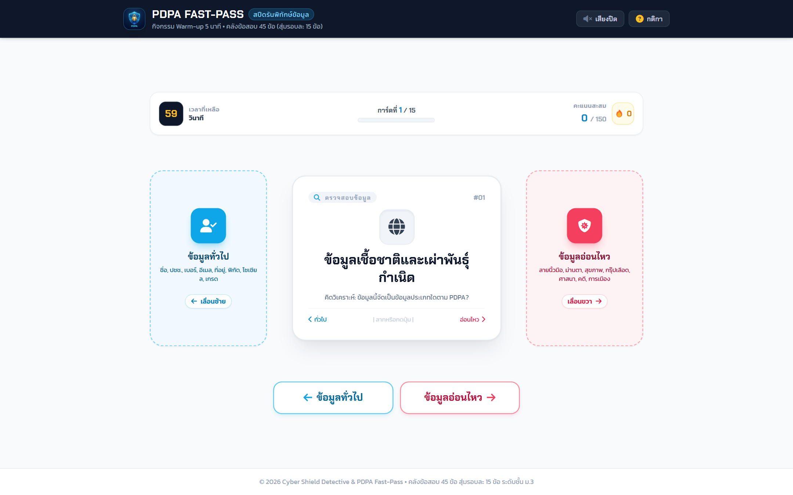

# 📖 คู่มือการใช้งานและโครงสร้างระบบ: PDPA Fast-Pass สปีดรัน 60 วินาที (`pdpa_fast_pass.html`)

**PDPA Fast-Pass: สปีดรันพิทักษ์ข้อมูล (`pdpa_fast_pass.html`)** คือ เกมการเรียนรู้แนว **Speedrun Card Sorting 60 วินาที** ที่ท้าทายให้นักเรียนฝึกสัญชาตญาณและความแม่นยำในการแยกแยะข้อมูลส่วนบุคคล โดยระบบจะสุ่มการ์ด 15 ข้อจาก **คลังข้อสอบมาตรฐาน 45 ข้อ** ให้นักเรียนปัดการ์ดหรือคลิกเลือกว่าเป็น **ข้อมูลทั่วไป (General Data - สีฟ้า)** หรือ **ข้อมูลอ่อนไหว (Sensitive Data - สีชมพูแดง)** พร้อมระบบตัวคูณคอมโบและตารางจัดอันดับ

---

## 🌟 1. ภาพรวมและวัตถุประสงค์ (Overview & Learning Objectives)

### 🎯 วัตถุประสงค์การเรียนรู้
1. **การตัดสินใจอย่างรวดเร็วและแม่นยำ (Rapid DQ Decision Making)**: ฝึกการแยกแยะข้อมูลส่วนบุคคลภายใต้ข้อจำกัดของเวลา (60 วินาที)
2. **คลังข้อสอบครอบคลุม 45 สถานการณ์จริง**: มีตัวอย่างข้อมูลหลากหลาย เช่น ประวัติกรุ๊ปเลือด, เลขบัตรประชาชน, ลายนิ้วมือ, ศาสนา, ทะเบียนรถ, ประวัติการค้นหา, ประวัติการรักษา
3. **ระบบคิดเกรดและแรงขับเคลื่อน Gamification**: คำนวณความแม่นยำ (Accuracy %), Streak Combo, และจัดลำดับเหรียญทอง/เงิน/ทองแดง

---

## 👨‍🏫 2. สิ่งที่ครู/ผู้สอนควรชี้แนะแก่นักเรียน (Pedagogical Guidelines)

### 💡 เคล็ดลับการสอนและการเล่น
- **เทคนิคการแยกแยะ**:
  - *ข้อมูลอ่อนไหว (Sensitive)*: อะไรที่กระทบจิตใจ, ความเชื่อ, ร่างกาย/สุขภาพ, หรือเสี่ยงต่อการถูกกลั่นแกล้ง = **อ่อนไหว (ปัดขวา/กดสีแดง)**
  - *ข้อมูลทั่วไป (General)*: ข้อมูลสำหรับติดต่อหรือระบุตัวตนภายนอก เช่น ชื่อ เบอร์โทร อีเมล เลขบัตร = **ทั่วไป (ปัดซ้าย/กดสีฟ้า)**
- **การรักษา Combo**: ตอบถูกต่อเนื่องจะได้รับคะแนนทวีคูณ (x2, x3, x4) ช่วยให้ได้เกรดระดับ Master

---

## 📸 3. ขั้นตอนการใช้งานทีละ Step พร้อมภาพสกรีนช็อตจริง (Step-by-Step Walkthrough)

### 🔹 Step 1: เมนูเริ่มต้นและกติกาเกม (Start Screen & Instructions)
ผู้เล่นอ่านกติกา 60 วินาที และกดปุ่ม **"🎮 เริ่มเล่นสปีดรันเลย!"**


*ภาพที่ 1: หน้าจอเริ่มต้นเกม PDPA Fast-Pass พร้อมตัวจับเวลาและกติกา*

---

### 🔹 Step 2: การ์ดเกมเพลย์และการแยกแยะ (Card Gameplay & Swipe Action)
แสดงการ์ดข้อสอบสุ่ม ผู้เล่นกดปุ่มสีฟ้า (ข้อมูลทั่วไป) หรือสีแดง (ข้อมูลอ่อนไหว) หรือใช้การปัดการ์ดบนมือถือ


*ภาพที่ 2: หน้าจอการเล่นเกมสปีดรัน แสดงการ์ดข้อมูล ตัวนับเวลาถอยหลัง และแถบคอมโบ*

---

## 📊 4. เกณฑ์การประเมินรูบริก (Rubric Matrix for PDPA Fast-Pass - เต็ม 15 ข้อ)

| ระดับความสามารถ (Rank) | จำนวนข้อที่ตอบถูก (จาก 15 ข้อ) | ความแม่นยำ (Accuracy) | เกณฑ์การประเมิน |
|---|:---:|:---:|---|
| 🥇 **PDPA Master (เก่งกาจระดับเซียน)** | **14 - 15 ข้อ** | **90% - 100%** | แยกแยะข้อมูลทั่วไปและอ่อนไหวได้ถูกต้องแม่นยำเกือบสมบูรณ์ในภาวะกดดัน |
| 🥈 **PDPA Expert (ผู้พิทักษ์ข้อมูลมือโปร)** | **11 - 13 ข้อ** | **70% - 89%** | มีความเข้าใจดีเยี่ยม สับสนข้อมูลก้ำกึ่งเพียงเล็กน้อย |
| 🥉 **PDPA Junior (สายสืบฝึกหัด)** | **8 - 10 ข้อ** | **50% - 69%** | ผ่านเกณฑ์พื้นฐาน ควรทบทวนเรื่องข้อมูลพันธุกรรมและชีวมิติ |
| ⚠️ **Need Training (ต้องฝึกฝนเพิ่มเติม)** | **น้อยกว่า 8 ข้อ** | **ต่ำกว่า 50%** | ไม่ผ่านเกณฑ์ ควรกลับไปศึกษาสไลด์ `pdpa_presentation.html` แล้วเล่นใหม่ |

---

## 💻 5. ผ่าสถาปัตยกรรมโค้ดและการทำงานเชิงลึก (Detailed Code Breakdown)

### ⏱️ ตัวจัดการเวลา Countdown Timer & Combo
```javascript
let timeLeft = 60;
let timerInterval = null;
let currentCombo = 0;
let score = 0;

function startTimer() {
    timerInterval = setInterval(() => {
        timeLeft--;
        document.getElementById('timer-display').textContent = `${timeLeft}s`;
        if (timeLeft <= 0) {
            clearInterval(timerInterval);
            endGame();
        }
    }, 1000);
}

function handleAnswer(selectedType) {
    const currentCard = gameQuestions[currentIndex];
    const isCorrect = selectedType === currentCard.type; // 'general' | 'sensitive'

    if (isCorrect) {
        currentCombo++;
        score += 100 * Math.min(currentCombo, 4); // Multiplier สูงสุด x4
        playSuccessSFX();
    } else {
        currentCombo = 0; // ตัดคอมโบเมื่อตอบผิด
        playFailSFX();
    }
    nextCard();
}
```

---

## ⚠️ 6. กรณีพิเศษ การตรวจจับข้อผิดพลาด และวิธีแก้ไข (Edge Cases & Troubleshooting)

| ปัญหา | สาเหตุ | การแก้ไข |
|---|---|---|
| **ปุ่มสัมผัสบนมือถือกดไม่ติด** | มือเผลอแตะโดนพื้นที่ Drag บนหน้าจอสัมผัส | โค้ดมี `touch-action: manipulation` และรองรับทั้ง Tap Button และ Touch Swipe ควบคู่กัน |
| **หมดเวลา 60s ก่อนตอบครบ 15 ข้อ** | ผู้เล่นคิดนานในบางข้อ | ระบบจะตัดเกรดจากจำนวนข้อที่ตอบทันทันที ไม่ทำให้หน้าจอค้าง |
