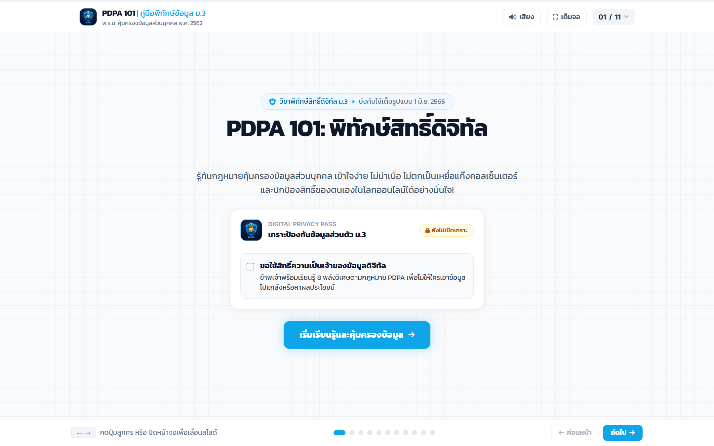
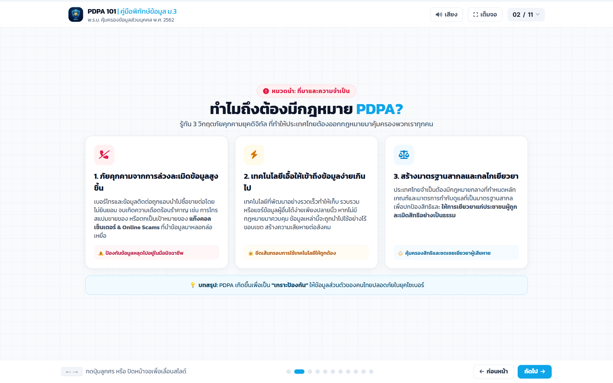

# 📖 คู่มือการใช้งานและโครงสร้างระบบ: สไลด์บทเรียน PDPA 101 & เกียรติบัตร (`pdpa_presentation.html`)

**PDPA 101: คู่มือพิทักษ์ข้อมูลส่วนตัวสุดคูล ฉบับวัยรุ่น ม.3 (`pdpa_presentation.html`)** คือ สื่อนำเสนออินเทอร์แอคทีฟดีไซน์คลีนสไตล์ Modern Tech สรุปสาระสำคัญของ **พระราชบัญญัติคุ้มครองข้อมูลส่วนบุคคล พ.ศ. 2562 (PDPA)** พร้อม 4 กรณีศึกษาจริง ควิซวัดความเข้าใจ และระบบสร้างเกียรติบัตรดิจิทัล (Digital Certificate) อัตโนมัติ

---

## 🌟 1. ภาพรวมและวัตถุประสงค์ (Overview & Learning Objectives)

### 🎯 วัตถุประสงค์การเรียนรู้
1. **แยกแยะประเภทข้อมูลส่วนบุคคล (Data Classification)**: เข้าใจความแตกต่างอย่างลึกซึ้งระหว่าง *ข้อมูลส่วนบุคคลทั่วไป (General Personal Data)* และ *ข้อมูลส่วนบุคคลอ่อนไหว (Sensitive Personal Data)*
2. **เข้าใจสิทธิ 8 ประการของเจ้าของข้อมูล (8 Data Subject Rights)**: เช่น สิทธิในการขอเข้าถึงข้อมูล, สิทธิขอให้ลบ/ทำลาย, สิทธิคัดค้านการประมวลผล
3. **การประเมินและรับเกียรติบัตร (Certificate Assessment)**: เมื่อเรียนจบสไลด์ ผู้เรียนทำแบบทดสอบวัดผล หากผ่านเกณฑ์ 80% ระบบจะสร้างเกียรติบัตรดิจิทัลระบุชื่อและคะแนนให้ดาวน์โหลดเป็นภาพ PNG ทันที

---

## 👨‍🏫 2. สิ่งที่ครู/ผู้สอนควรชี้แนะแก่นักเรียน (Pedagogical Guidelines)

### 💡 ประเด็นสำคัญที่ต้องเน้นในห้องเรียน
- **ข้อมูลอ่อนไหว (Sensitive Data) ต้องระวังเป็น 2 เท่า**: เช่น ประวัติสุขภาพ ศาสนา เชื้อชาติ ข้อมูลพันธุกรรม และลายนิ้วมือ/สแกนใบหน้า เพราะหากรั่วไหลจะนำไปสู่การเลือกปฏิบัติและการกลั่นแกล้ง
- **หลักการขอความยินยอม (Consent)**: การถ่ายรูปเพื่อนหรือคลิปในโรงเรียนแล้วอัปโหลดลง TikTok/Instagram โดยที่เพื่อนไม่อนุญาต ถือเป็นการละเมิด PDPA
- **การพิมพ์ชื่อรับเกียรติบัตร**: แนะนำให้นักเรียนสะกดชื่อ-นามสกุล และชื่อโรงเรียนให้ถูกต้องก่อนกดยืนยันสร้างเกียรติบัตร

---

## 📸 3. ขั้นตอนการใช้งานทีละ Step พร้อมภาพสกรีนช็อตจริง (Step-by-Step Walkthrough)

### 🔹 Step 1: สไลด์หน้าปกและสารบัญบทเรียน (PDPA Cover & Outline)
หน้าแรกของสไลด์แสดงหัวข้อบทเรียนและภาพกราฟิกสรุปภาพรวม


*ภาพที่ 1: หน้าปกสไลด์ PDPA 101 พร้อมการออกแบบสไตล์ Modern Minimal*

---

### 🔹 Step 2: สไลด์วิเคราะห์เนื้อหาและกรณีศึกษา (Content Slides & Case Studies)
สไลด์นำเสนอประเภทข้อมูล, ฐานความยินยอม, สิทธิ 8 ประการ และ 4 กรณีศึกษาในโรงเรียน


*ภาพที่ 2: สไลด์แจกแจงข้อมูลทั่วไป vs ข้อมูลอ่อนไหว พร้อมตัวอย่างประกอบ*

---

## 📊 4. เกณฑ์การประเมินรูบริก (Rubric Matrix for PDPA Quiz & Certificate)

| มิติการประเมิน | ระดับ 4 (ดีเยี่ยม - ผ่านเกณฑ์เกียรติบัตร) | ระดับ 3 (ดี) | ระดับ 2 (พอใช้) | ระดับ 1 (ปรับปรุง) |
|---|---|---|---|---|
| **การจำแนกข้อมูลทั่วไป vs อ่อนไหว** | จำแนกถูกต้อง 100% ครบทุกกรณีศึกษา | จำแนกถูกต้อง 80% - 90% | จำแนกถูกต้อง 60% - 79% สับสนข้อมูลสุขภาพบางข้อ | จำแนกถูกน้อยกว่า 60% ไม่เข้าใจความเสี่ยงข้อมูลอ่อนไหว |
| **ความเข้าใจสิทธิ 8 ประการ** | อธิบายสิทธิและยกตัวอย่างการใช้สิทธิในชีวิตประจำวันได้ถูกต้อง | จำสิทธิสำคัญได้ 5-7 สิทธิ | จำสิทธิได้ 3-4 สิทธิ | จำสิทธิไม่ได้ |
| **ผลคะแนนควิซรับเกียรติบัตร** | ได้คะแนน 8 - 10 เต็ม 10 (ได้รับเกียรติบัตรระดับทอง) | ได้คะแนน 7 เต็ม 10 | ได้คะแนน 5 - 6 เต็ม 10 | ได้คะแนนต่ำกว่า 5 เต็ม 10 (ต้องทำซ้ำ) |

---

## 💻 5. ผ่าสถาปัตยกรรมโค้ดและการทำงานเชิงลึก (Detailed Code Breakdown)

### 🎨 ระบบวาดเกียรติบัตร HTML5 Canvas (`generateCertificateCanvas`)
```javascript
// วาดภาพเกียรติบัตรความละเอียดสูงและเรนเดอร์เป็นภาพ PNG
function renderCertificate(studentName, score, dateStr) {
    const canvas = document.getElementById('cert-canvas');
    const ctx = canvas.getContext('2d');
    canvas.width = 1920;
    canvas.height = 1080;

    // 1. วาดพื้นหลัง Gradient & Border หรูหรา
    const grad = ctx.createLinearGradient(0, 0, 1920, 1080);
    grad.addColorStop(0, '#0F172A');
    grad.addColorStop(1, '#0369A1');
    ctx.fillStyle = grad;
    ctx.fillRect(0, 0, 1920, 1080);

    // 2. วาดข้อความชื่อนักเรียนและคะแนน
    ctx.font = 'bold 56px Kanit';
    ctx.fillStyle = '#F8FAFC';
    ctx.textAlign = 'center';
    ctx.fillText(studentName, 960, 540);

    // 3. Export เป็น Data URL สำหรับดาวน์โหลด
    const dataUrl = canvas.toDataURL('image/png');
    document.getElementById('download-cert-btn').href = dataUrl;
}
```

---

## ⚠️ 6. กรณีพิเศษ การตรวจจับข้อผิดพลาด และวิธีแก้ไข (Edge Cases & Troubleshooting)

| ปัญหา | สาเหตุ | การแก้ไข |
|---|---|---|
| **ดาวน์โหลดเกียรติบัตรบน Safari/iOS ไม่ได้** | นโยบายบล็อกการดาวน์โหลดไฟล์ Data URL อัตโนมัติ | ระบบมีปุ่มสำรอง `เปิดภาพในแท็บใหม่` ให้นักเรียนกดค้างเพื่อบันทึกภาพลงเครื่องได้ |
| **ตัวอักษรภาษาไทยในเกียรติบัตรไม่ขึ้น Font Kanit** | เบราว์เซอร์ยังโหลด Web Font ไม่เสร็จก่อนวาด Canvas | มีฟังก์ชัน `document.fonts.ready.then(...)` รอ Font โหลดเสร็จ 100% ก่อนเริ่มวาด |
