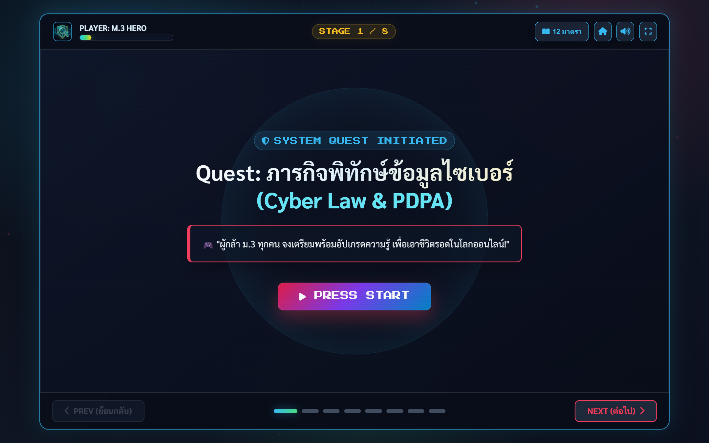
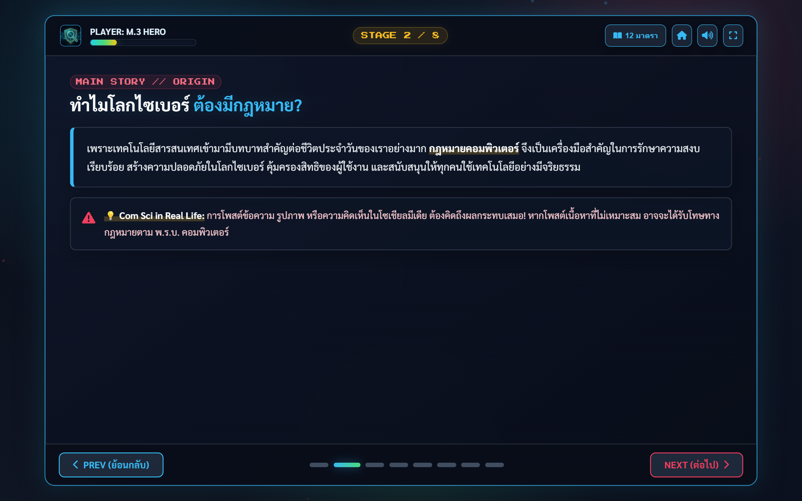

# 📖 คู่มือการใช้งานและโครงสร้างระบบ: สไลด์บทเรียน พ.ร.บ.คอมพิวเตอร์ 12 มาตรา RPG (`presentation.html`)

**Quest: ภารกิจพิทักษ์ข้อมูลไซเบอร์ (`presentation.html`)** คือ สไลด์บทเรียนเชิงโต้ตอบ (Interactive Slide Deck) ในธีมเกม RPG ยุคเรโทร ผสมผสานระบบแอนิเมชัน Canvas, ระบบสังเคราะห์เสียง SFX/BGM ด้วย Web Audio API, ควิซทดสอบความรู้โต้ตอบระหว่างสไลด์ และเมนูลัดกระโดดดูเนื้อหา 12 มาตรา พ.ร.บ.คอมพิวเตอร์ 2560 ครบถ้วน

---

## 🌟 1. ภาพรวมและวัตถุประสงค์ (Overview & Learning Objectives)

### 🎯 วัตถุประสงค์การเรียนรู้
1. **สรุปสาระสำคัญ 12 มาตราอย่างเห็นภาพ (Gamified Legal Literacy)**: เรียนรู้ฐานความผิด มาตรา 5, 6, 7, 8, 9, 10, 11, 12, 14(1), 14(2), 14(4), 16 ผ่านสถานการณ์ตัวอย่างที่เข้าถึงง่าย
2. **สร้างการมีส่วนร่วมผ่าน Interactive Micro-Quizzes**: นักเรียนตอบคำถามแบบเลือกตอบบนสไลด์เพื่อเก็บค่าพลัง HP และค่า EXP
3. **เครื่องมือบรรยายสำหรับครู (Teacher Presentation Tool)**: รองรับการควบคุมด้วยคีย์บอร์ด (ลูกศรซ้าย/ขวา, Spacebar, ปุ่ม F เพื่อเข้า Fullscreen) และหน้าต่างเลือกมาตราแบบ Quick Nav

---

## 👨‍🏫 2. สิ่งที่ครู/ผู้สอนควรชี้แนะแก่นักเรียน (Pedagogical Guidelines)

### 💡 เทคนิคการสอนด้วยสไลด์ชุดนี้
- **การใช้แถบพลัง HP**: ชี้แจงให้นักเรียนเห็นว่าหากตอบผิดในควิซระหว่างสไลด์ HP จะลดลง เพื่อสร้างบรรยากาศ Gamification ในห้องเรียน
- **การเปิดเสียงประกอบ (Retro 8-bit Audio)**: แนะนำให้ต่อเครื่องเสียงห้องเรียนเพื่อเพิ่มความสนุกและตื่นเต้น
- **การใช้เมนูลัด 12 มาตรา**: เมื่อสอนจบหรือต้องการทบทวนเฉพาะมาตราใด สามารถกดปุ่ม `📖 12 มาตรา` ที่มุมขวาบนเพื่อเปิด Modal สรุปเนื้อหาได้ทันที

---

## 📸 3. ขั้นตอนการใช้งานทีละ Step พร้อมภาพสกรีนช็อตจริง (Step-by-Step Walkthrough)

### 🔹 Step 1: สไลด์หน้าปกและเริ่มภารกิจ (Cover Slide & Audio Init)
เมื่อเปิดหน้าเว็บ ผู้เรียนจะพบกับสไลด์ธีม Cyber RPG พร้อมปุ่ม `▶️ เริ่มภารกิจ` เพื่อเริ่มต้นเล่นเพลงและสไลด์


*ภาพที่ 1: สไลด์หน้าปกภารกิจพิทักษ์ข้อมูลไซเบอร์พร้อมแถบ HP และเมนูควบคุมเสียง/เต็มจอ*

---

### 🔹 Step 2: สไลด์เนื้อหาและควิซโต้ตอบ (Lesson Slides & Penalty Matrix)
เนื้อหาจะแสดงองค์ประกอบความผิด อัตราโทษจำคุก/ปรับ และตัวอย่างพฤติกรรมในชีวิตประจำวัน พร้อมควิซโต้ตอบ


*ภาพที่ 2: สไลด์สรุปเนื้อหามาตรากฎหมายพร้อมกล่องตัวอย่างและบททดสอบ*

---

## 📊 4. เกณฑ์การประเมินรูบริก (Rubric Matrix for Slide Quiz & Engagement)

| มิติการประเมิน | ระดับ 4 (ดีเยี่ยม) | ระดับ 3 (ดี) | ระดับ 2 (พอใช้) | ระดับ 1 (ปรับปรุง) |
|---|---|---|---|---|
| **ความแม่นยำในการตอบควิซระหว่างสไลด์** | ตอบควิซถูกครบทุกข้อ HP เหลือเต็ม 100% | ตอบควิซถูกเกิน 80% HP เหลือมากกว่า 70% | ตอบถูก 50% - 79% HP ลดลงปานกลาง | ตอบถูกน้อยกว่า 50% หรือ HP หมด |
| **การเชื่อมโยงมาตรากับคดีจริง** | อธิบายได้ทันทีว่าตัวอย่างในสไลด์เข้าข่ายมาตราใดและโทษสูงสุดเท่าไร | ระบุมาตราได้ถูกต้องแต่อัตราโทษคลาดเคลื่อนเล็กน้อย | ระบุมาตราได้บางส่วน ต้องเปิดดูคู่มือ | ไม่สามารถจับคู่มาตรากับพฤติกรรมได้ |

---

## 💻 5. ผ่าสถาปัตยกรรมโค้ดและการทำงานเชิงลึก (Detailed Code Breakdown)

### 🎵 ระบบสังเคราะห์เสียง Web Audio API (Zero External MP3 Latency)
ไฟล์ `presentation.html` สร้างเสียง Sound Effects ทั้งหมดผ่าน Web Audio Oscillator ในเบราว์เซอร์:
```javascript
// สังเคราะห์เสียงเรโทร 8-bit โดยไม่ต้องดาวน์โหลดไฟล์เสียงภายนอก
class RetroAudioEngine {
    constructor() {
        this.ctx = new (window.AudioContext || window.webkitAudioContext)();
    }
    playBeep(freq = 440, type = 'square', duration = 0.1) {
        if (!this.ctx) return;
        const osc = this.ctx.createOscillator();
        const gain = this.ctx.createGain();
        osc.type = type;
        osc.frequency.setValueAtTime(freq, this.ctx.currentTime);
        gain.gain.setValueAtTime(0.15, this.ctx.currentTime);
        gain.gain.exponentialRampToValueAtTime(0.01, this.ctx.currentTime + duration);
        osc.connect(gain);
        gain.connect(this.ctx.destination);
        osc.start();
        osc.stop(this.ctx.currentTime + duration);
    }
}
```

### ⌨️ ระบบคีย์บอร์ดชอร์ตคัต (Keyboard Shortcuts Event)
- `ArrowRight` / `Spacebar` / `PageDown`: ไปสไลด์ถัดไป
- `ArrowLeft` / `PageUp`: ย้อนกลับสไลด์ก่อนหน้า
- `KeyF`: เข้า/ออกจากโหมดเต็มหน้าจอ (Fullscreen Mode)

---

## ⚠️ 6. กรณีพิเศษ การตรวจจับข้อผิดพลาด และวิธีแก้ไข (Edge Cases & Troubleshooting)

| ปัญหา | สาเหตุ | การแก้ไข |
|---|---|---|
| **ไม่มีเสียงเพลง/SFX เมื่อเปิดหน้าเว็บ** | นโยบาย Autoplay ของเบราว์เซอร์บล็อกเสียงอัตโนมัติ | ให้คลิกปุ่ม `▶️ เริ่มภารกิจ` หรือปุ่มไอคอนลำโพง 1 ครั้ง เพื่อปลดล็อก AudioContext |
| **ภาพฉากหลังเคลื่อนไหวช้าบนคอมพิวเตอร์รุ่นเก่า** | ตัวประมวลผลกราฟิก (GPU) ต่ำ | ระบบจะปรับลด Particle Canvas ลงอัตโนมัติเมื่อ FPS ต่ำกว่า 30 |
