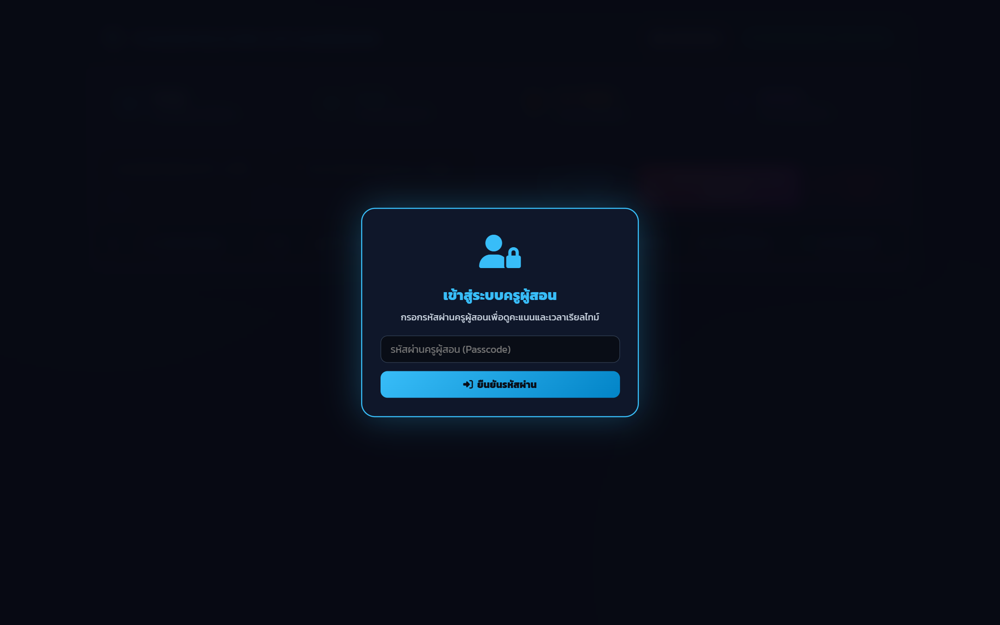
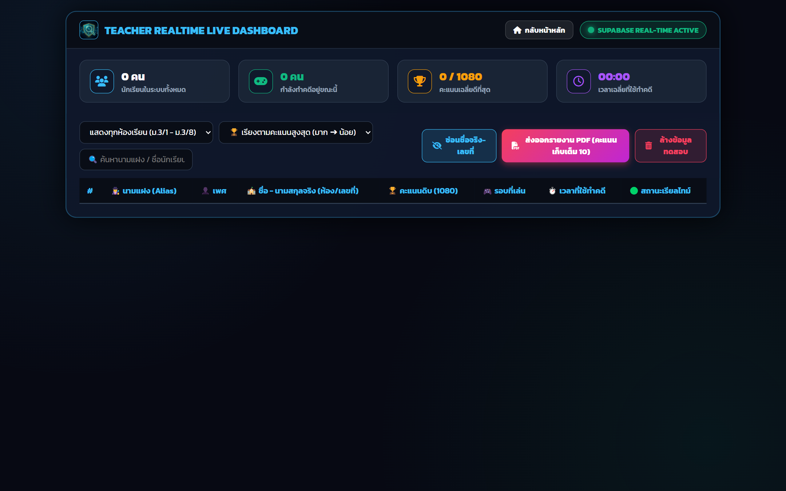

# 📖 คู่มือการใช้งานและโครงสร้างระบบ: แดชบอร์ดสรุปคะแนนครูผู้สอน Realtime v3 (`teacher_dashboard.html`)

**ระบบแดชบอร์ดสรุปผลคะแนนสำหรับครูผู้สอน (`teacher_dashboard.html`)** คือ หน้าแดชบอร์ดสแตนด์อโลน (Standalone Realtime Monitoring Dashboard) สำหรับมอนิเตอร์คะแนนเกมสืบคดีไซเบอร์ v3 ที่เชื่อมโยงกับ Supabase Realtime พร้อมฟังก์ชันกรองข้อมูลตามห้องเรียน (ม.3/1 - ม.3/8), ซ่อนชื่อจริง-เลขที่ (Anonymization Mode เพื่อความปลอดภัยของข้อมูลส่วนบุคคล), และคำนวณแปลงคะแนนดิบ (1,080 คะแนน) สู่คะแนนเก็บรายวิชา (เต็ม 10 คะแนน) ส่งออกเป็นรายงาน PDF ทันที

---

## 🌟 1. ภาพรวมและวัตถุประสงค์ (Overview & Learning Objectives)

### 🎯 วัตถุประสงค์หลัก
1. **ศูนย์รวมคะแนนเก็บวิทยาการคำนวณ ม.3**: มอนิเตอร์คะแนนสะสมของนักเรียนทั้งระดับชั้น พร้อมแสดงสถานะผู้กำลังเล่น (Active Players), คะแนนเฉลี่ย, และเวลาเฉลี่ย
2. **โหมดปกป้องข้อมูลส่วนบุคคล (PDPA Masking Mode)**: สามารถกดปุ่ม `👁️ ซ่อนชื่อจริง-เลขที่` เพื่อฉายคะแนนขึ้นจอโปรเจกเตอร์หน้าห้องเรียนโดยแสดงเฉพาะนามแฝง (Alias) ไม่ละเมิดสิทธิความเป็นส่วนตัวของนักเรียน
3. **การแปลงคะแนนอัตโนมัติ (Raw Score to Standard Grade Scale)**: คำนวณตัดเกรดและแปลงคะแนนดิบสู่คะแนนเก็บ 10 คะแนนสำหรับกรอก ปพ.5

---

## 👨‍🏫 2. สิ่งที่ครู/ผู้สอนควรชี้แนะแก่นักเรียน (Pedagogical Guidelines)

### 💡 แนวทางการใช้งานของครู
- **การใช้ Masking Mode ในห้องเรียน**: หากต้องการสร้างแรงบันดาลใจด้วย Leaderboard ให้เปิดปุ่มซ่อนชื่อจริง เพื่อแสดงเฉพาะนามแฝงนักสืบและคะแนนสะสม
- **การกรองดูรายห้อง (Room Filter)**: ครูสามารถเลือกกรองดูเฉพาะห้องที่กำลังสอน (เช่น ม.3/1 หรือ ม.3/2) เพื่อดูความก้าวหน้ารายบุคคล
- **การส่งออก PDF**: กดปุ่ม `📄 ส่งออกรายงาน PDF (คะแนนเก็บเต็ม 10)` เพื่อจัดพิมพ์ใบสรุปคะแนนประจำคาบ

---

## 📸 3. ขั้นตอนการใช้งานทีละ Step พร้อมภาพสกรีนช็อตจริง (Step-by-Step Walkthrough)

### 🔹 Step 1: ล็อกอินผ่านหน้าต่าง Passcode (Auth Modal)
ครูกรอกรหัสผ่านเพื่อเข้าถึงฐานข้อมูลคะแนนนักเรียน


*ภาพที่ 1: หน้าต่างยืนยันรหัสผ่านเพื่อเข้าใช้งานแดชบอร์ดครู*

---

### 🔹 Step 2: แดชบอร์ดมอนิเตอร์และแถบสถิติภาพรวม (Realtime Stats & Table)
แดชบอร์ดแสดงการ์ด 4 สถิติ (นักเรียนทั้งหมด, กำลังเล่น, คะแนนเฉลี่ย, เวลาเฉลี่ย) และตารางแสดงคะแนนรายบุคคล


*ภาพที่ 2: ตารางแสดงคะแนนเรียลไทม์ พร้อมตัวกรองห้องเรียน และปุ่มซ่อนชื่อจริง*

---

## 📊 4. เกณฑ์การแปลงคะแนนเก็บ (Raw Score 1,080 to Formative Score 10 Scale)

| คะแนนดิบในเกม (เต็ม 1,080) | คะแนนเก็บรายวิชา (เต็ม 10) | ระดับคุณภาพ | คำอธิบายสมรรถนะ |
|:---:|:---:|:---:|---|
| **972 - 1,080 คะแนน (90% - 100%)** | **10 คะแนน** | ดีเยี่ยม | มีความรู้ความเข้าใจกฎหมายคอมพิวเตอร์และ PDPA ในระดับเชี่ยวชาญ |
| **864 - 971 คะแนน (80% - 89%)** | **8.5 - 9.5 คะแนน** | ดีมาก | วิเคราะห์ข้อกฎหมายและระงับเหตุได้ถูกต้องเป็นส่วนใหญ่ |
| **756 - 863 คะแนน (70% - 79%)** | **7.5 - 8.0 คะแนน** | ดี | ผ่านเกณฑ์มาตรฐาน เข้าใจองค์ประกอบความผิดหลัก |
| **648 - 755 คะแนน (60% - 69%)** | **6.5 - 7.0 คะแนน** | พอใช้ | ผ่านเกณฑ์ขั้นต่ำ ควรศึกษาทบทวนเพิ่มเติม |
| **ต่ำกว่า 648 คะแนน (< 60%)** | **ต่ำกว่า 6.0 คะแนน** | ปรับปรุง | ไม่ผ่านเกณฑ์ ต้องเรียนเสริมและสอบแก้ตัว |

---

## 💻 5. ผ่าสถาปัตยกรรมโค้ดและการทำงานเชิงลึก (Detailed Code Breakdown)

### 📊 การคำนวณสถิติและการอัปเดต DOM ใน `js/teacher_dashboard.js`
```javascript
// ฟังก์ชันคำนวณค่าเฉลี่ยและอัปเดตสถิติ Dashboard
function calculateStats(students) {
    const total = students.length;
    const active = students.filter(s => s.status === 'in-game').length;
    const avgScore = total > 0 
        ? Math.round(students.reduce((sum, s) => sum + (s.score || 0), 0) / total) 
        : 0;

    document.getElementById('stat-total-students').textContent = `${total} คน`;
    document.getElementById('stat-active-now').textContent = `${active} คน`;
    document.getElementById('stat-avg-score').textContent = `${avgScore} / 1080`;
}
```

---

## ⚠️ 6. กรณีพิเศษ การตรวจจับข้อผิดพลาด และวิธีแก้ไข (Edge Cases & Troubleshooting)

| ปัญหา | สาเหตุ | การแก้ไข |
|---|---|---|
| **ชื่อนักเรียนซ้ำกันในตาราง** | นักเรียนเล่นซ้ำหลายรอบ | ระบบจะจัดกลุ่มตามชื่อ-เลขที่ และแสดงคะแนนของรอบที่ดีที่สุด (Best Attempt) โดยอัตโนมัติ |
| **ต้องการล้างข้อมูลทดสอบ** | ครูทดสอบระบบก่อนเริ่มสอนจริง | กดปุ่ม `🗑️ ล้างข้อมูลทดสอบ` เพื่อเคลียร์ตารางให้พร้อมสำหรับนักเรียน |
